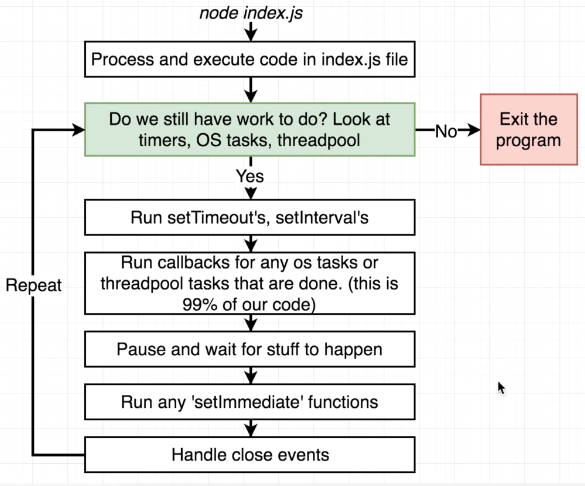
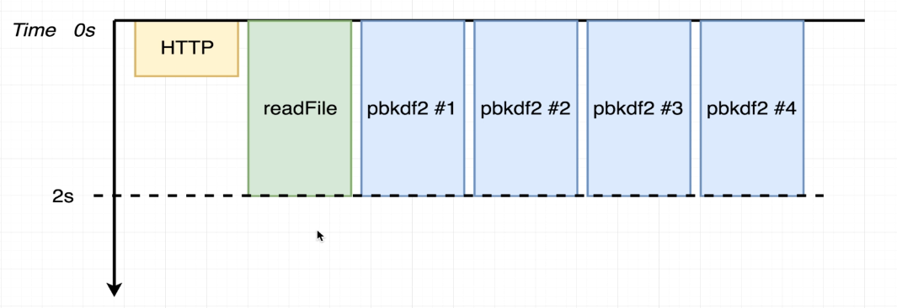
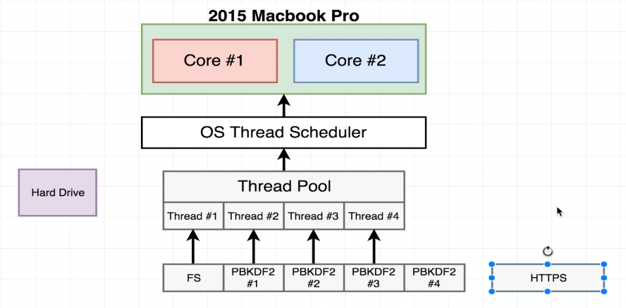
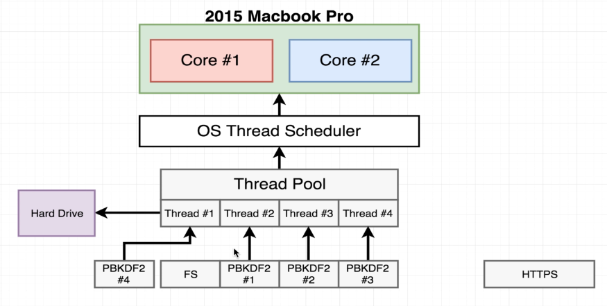
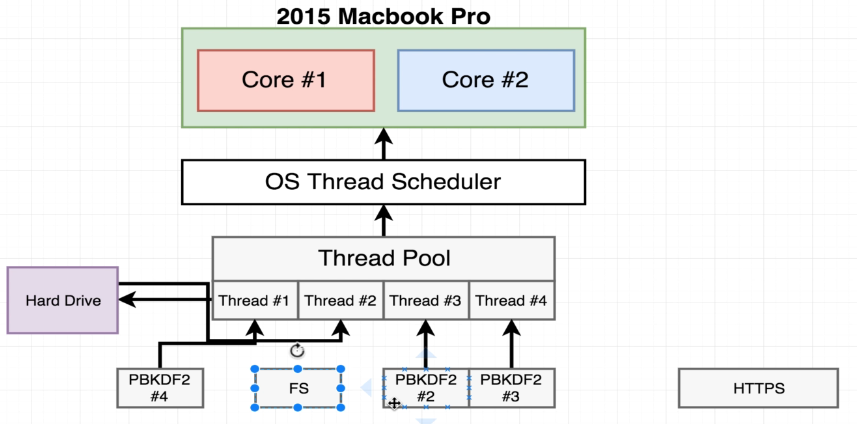

# Node.js Event Loop JavaScript Code Execution Flow

## Overview of the Node.js Event Loop

The Node.js event loop is a fundamental concept that allows the execution of asynchronous callbacks. This is crucial to
Node.js’s non-blocking I/O and concurrency model. The event loop enables Node.js to perform I/O operations, such as
network requests, file system access, or timers, without blocking the main thread. The event loop continuously checks 
for pending tasks and executes the appropriate callbacks.

### Phases of the Event Loop

The event loop is divided into several phases, each responsible for handling specific types of tasks. The diagram 
provided shows the general flow of the event loop and how it manages asynchronous tasks.

### Detailed Flow

1. **Process and execute code in index.js file**
    - The event loop starts by executing the code in the index.js file (or any other entry point).
    - This is typically where you write your application logic, including any asynchronous functions like `setTimeout`, 
      `setInterval`, or I/O operations.

2. **Check for pending work (Timers, OS Tasks, Threadpool)**
    - After the code is executed, the event loop checks whether there are still tasks to process. These tasks could 
      include:
        - **Timers**: Registered through `setTimeout` or `setInterval`.
        - **OS Tasks**: Tasks such as server listening or incoming network connections.
        - **Threadpool Tasks**: File system operations or cryptographic operations handled by the thread pool.

3. **Run setTimeout's, setInterval's**
    - If there are any timers (such as `setTimeout` or `setInterval`) that are due, their callbacks are executed in this
      phase.

4. **Run callbacks for any OS tasks or threadpool tasks**
    - This is where most of the I/O or computational callbacks are processed. For instance:
        - File I/O operations (reading or writing to disk).
        - Incoming network requests.
        - Database queries.
    - This phase processes the majority of asynchronous tasks that are queued.

5. **Pause and wait for tasks to complete**
    - After processing the tasks, the event loop may enter a waiting state, where it pauses and waits for new events to 
      occur (like I/O events or timers).

6. **Run 'setImmediate' functions**
    - If there are any `setImmediate()` callbacks scheduled, they are executed in this phase. The `setImmediate`
      function is used to execute a callback immediately after I/O events are processed.

7. **Handle close events**
    - In this phase, the event loop handles any close events. For example, when a server or socket closes, this phase 
      ensures the cleanup of resources.

8. **Repeat**
    - The event loop repeats this cycle continuously, processing new tasks as they are added to the queue.

9. **Exit the program**
    - The event loop will exit when there are no more tasks to process (timers, OS tasks, threadpool tasks). At this
      point, the program terminates.

### Key Points

- **Non-blocking I/O**: The event loop is what enables Node.js to perform non-blocking I/O operations, which makes
  Node.js highly efficient for I/O-heavy tasks.
- **Phases**: Each phase of the event loop has a specific role, and the callbacks are processed accordingly.
- **setTimeout vs setImmediate**: `setTimeout` schedules tasks to be run after a specified delay, while `setImmediate` 
  schedules tasks to run immediately after I/O callbacks.

This model allows Node.js to handle multiple operations concurrently, without needing to create additional threads for
each task.

### Diagram of Execution Flow

The diagram below shows the flow of the event loop and the sequence in which tasks are processed:



[Source](https://www.udemy.com/course/advanced-node-for-developers/) <br/>

Understanding the event loop is crucial to writing efficient asynchronous code in Node.js.


# NodeJs File Read Operation
* We invoke the `fs.readFile()` function with the file name and the encoding type.
* Node get some statistics on the file from the file system, require hard drive(like file size, etc) access.
* **Hard drive access is done by the threadpool, statistics are returned to the event loop.**
* Node requests to read the file.
* **Hard drive access is done by the threadpool, file content streamed back to app.**
* Node returns the file content to us.

In those two-step we need more time ""Hard drive access is done by the threadpool, statistic are returned to the event
loop", "Hard drive access is done by the threadpool, file content streamed back to app" in those step execution stops
for a while.


# Task Execution Order

```js
const https = require('https');
const crypto = require('crypto');
const fs = require('fs');

const start = Date.now();

function doRequest () {
    https.request('https://www.google.com', res => {
        res.on('data', () => {});
        res.on('end', () => {
            console.log('HTTP Request:', Date.now() - start);
        });
    }).end();
}

function doHash() {
    crypto.pbkdf2('a', 'b', 100000, 512, 'sha512', () => {
        console.log('Hash:', Date.now() - start);
    });
}

doRequest();

fs.readFile('test2.js', 'utf8', () => {
    console.log('FS:', Date.now() - start);
})

doHash();
doHash();
doHash();
doHash();
```
Output while run the node code with `node test2.js` command:
```
HTTP Request: 778
Hash: 1058
FS: 1059
Hash: 1074
Hash: 1084
Hash: 1152
```



[Source](https://www.udemy.com/course/advanced-node-for-developers/)

In NodeJs it use threadpool for some of the operations like file system operations or cryptographic operations. The
threadpool is used to handle blocking operations that may otherwise block the event loop. And for some other operation
like HTTP requests, timers, and I/O operations, the event loop is used. Which is handle by OS.

HTTP request is handled by the OS, so it's not handled by the threadpool. So, it's not blocking the event loop. That's 
why the HTTP request is completed first. Then the file system operation is completed. And then the hashing functions and
file read operations are handled by the threadpool. Normally, file read does not take much time. But the hashing functions
are CPU intensive operations. So, both of them are handled by the threadpool. That's why the hashing and file read 
operations are completed almost at the same time.


### Why Always First HTTP Then One Hash Then File Read Then Other Hashes?
Consider the diagram

 

[Source](https://www.udemy.com/course/advanced-node-for-developers/)

The HTTP request is handled by the OS, so it's not handled by the threadpool. It calls the network module in the OS. And
put it at callback queue of event loop and as it do not depends on the threadpool as soon as the response is received it
console exact that time. 

By default nodejs has 4 threads in the threadpool. So, suppose file read operation handled by first thread and then three
hashing functions are handled by other three threads. But, we know for reading file we need time in two steps(mentioned
above). So thread 1 will be realised the file read operation and then it will be free. Remaining one hasing function will
be assigned to thread 1. Meanwhile, thread 2, 3, 4 will continue with hashing functions. 



[Source](https://www.udemy.com/course/advanced-node-for-developers/)

Meanwhile, hashing from any thread 2, 3, or 4 will be completed first it will console after the HTTP request. Then one
thread will be free it will be assigned to file read operation again. In this case suppose thread 2 will be free and
will assign the file read operation.



[Source](https://www.udemy.com/course/advanced-node-for-developers/)

In the mean time hard disk access and statistics of the file will be done so it will returned and will get the time 
printed in the console. Then the remaining hashing functions will be completed and will be printed in the console. Thats
why the output is always HTTP request first, then one hashing function, then file read operation, then other hashing
functions like 
```bash
HTTP Request: 782
Hash: 1044
FS: 1045
Hash: 1056
Hash: 1101
Hash: 1111
```

But if we comment the hashing functions, 
```js
const https = require('https');
const crypto = require('crypto');
const fs = require('fs');

const start = Date.now();

function doRequest () {
    https.request('https://www.google.com', res => {
        res.on('data', () => {});
        res.on('end', () => {
            console.log('HTTP Request:', Date.now() - start);
        });
    }).end();
}

function doHash() {
    crypto.pbkdf2('a', 'b', 100000, 512, 'sha512', () => {
        console.log('Hash:', Date.now() - start);
    });
}

doRequest();

fs.readFile('test2.js', 'utf8', () => {
    console.log('FS:', Date.now() - start);
})

// doHash();
// doHash();
// doHash();
// doHash();
```
The output for `node test2.js` command:
```
FS: 56
HTTP Request: 486
```
If we comment the hashing functions, then there will be no CPU intensive operations. So, the file read operation is
completed first. Then the HTTP request is completed. Because the file read operation is handled by the threadpool. And
the HTTP request is handled by the OS. So, the file read operation is completed first. And then the HTTP request is
completed.


### Changing the Threadpool Size
```js
process.env.UV_THREADPOOL_SIZE = 5;

const https = require('https');
const crypto = require('crypto');
const fs = require('fs');

const start = Date.now();

function doRequest () {
    https.request('https://www.google.com', res => {
        res.on('data', () => {});
        res.on('end', () => {
            console.log('HTTP Request:', Date.now() - start);
        });
    }).end();
}

function doHash() {
    crypto.pbkdf2('a', 'b', 100000, 512, 'sha512', () => {
        console.log('Hash:', Date.now() - start);
    });
}

doRequest();

fs.readFile('test2.js', 'utf8', () => {
    console.log('FS:', Date.now() - start);
})

doHash();
doHash();
doHash();
doHash();
```
If we increase the thread pool size then the output will be different. The output for `node test2.js` command:
```
FS: 52
HTTP Request: 319
Hash: 2255
Hash: 2281
Hash: 2283
Hash: 2326
```
As now for file reading we get one dedicated thread and for hashing functions we get 4 threads. So, the file read
operation is completed first. Then the HTTP request is completed. Then the hashing functions are completed. 


If we decrease the thread pool size to `1` then the output will be different. 
```js
process.env.UV_THREADPOOL_SIZE = 1;

const https = require('https');
const crypto = require('crypto');
const fs = require('fs');

const start = Date.now();

function doRequest () {
    https.request('https://www.google.com', res => {
        res.on('data', () => {});
        res.on('end', () => {
            console.log('HTTP Request:', Date.now() - start);
        });
    }).end();
}

function doHash() {
    crypto.pbkdf2('a', 'b', 100000, 512, 'sha512', () => {
        console.log('Hash:', Date.now() - start);
    });
}

doRequest();

fs.readFile('test2.js', 'utf8', () => {
    console.log('FS:', Date.now() - start);
})

doHash();
doHash();
doHash();
doHash();
```
Then the output for `node test2.js` command:
```
HTTP Request: 381
Hash: 1153
Hash: 2269
Hash: 3358
Hash: 4444
FS: 4445
```


# Resources
* [Node JS: Advanced Concepts](https://www.udemy.com/course/advanced-node-for-developers/)