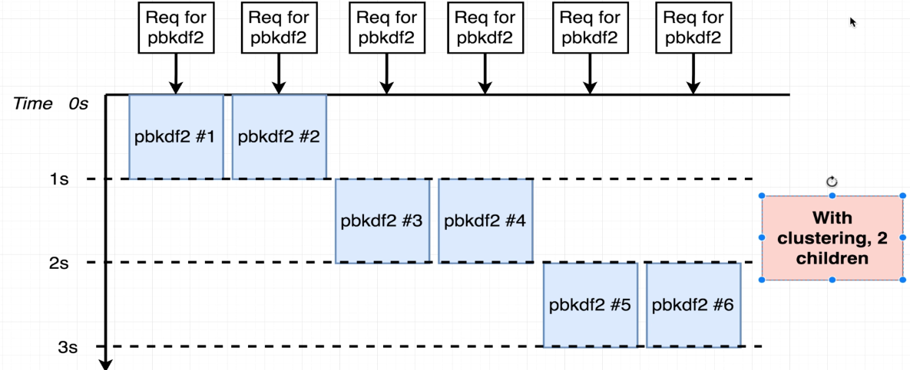
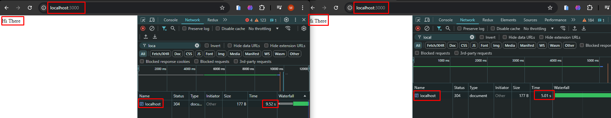

# Cluster Mode Performance Enhancement in Node.js

We cannot make Node.js use multiple threads directly, but we can make multiple copies of the same application run on
different cores of the CPU. This way, we can utilize the full potential of the CPU and enhance the performance of the
application. In cluster mode, multiple copies of the same Node.js application run on different cores of the CPU. This
allows full CPU utilization and enhanced performance. In this article, we will discuss how to enhance the performance
of a Node.js application using cluster mode.

## Cluster Mode in Node.js

In **cluster mode**, multiple instances (copies) of the same Node.js application run on different CPU cores. This allows
you to utilize all the CPU cores of a machine, enhancing the performance of your application by balancing the workload
across these cores. By default, Node.js runs on a single thread, which means it can only utilize one core of the CPU.
Cluster mode helps overcome this limitation, making it possible to scale an application to handle more traffic
efficiently.

### How It Works

- **Master Process**: In cluster mode, a **master process** is responsible for managing worker processes. The master
  listens for incoming requests and distributes them to the worker processes. The master process does not handle any
  application logic or perform heavy lifting—it simply coordinates workers.
- **Worker Processes**: The **worker processes** are clones of the main application process. These worker processes are
  responsible for handling the actual work (i.e., processing the incoming requests). Each worker runs on a separate CPU
  core and handles a portion of the traffic.
- **Load Balancing**: The master process acts as a load balancer. It distributes incoming requests to the worker
  processes in a round-robin fashion or based on system configurations. This ensures that each worker is actively
  utilized, and the incoming workload is efficiently spread across the available CPU cores.

### Cluster Module in Node.js

The `cluster` module is a built-in module in Node.js that provides a simple way to create worker processes that run on
different CPU cores. This allows you to scale Node.js applications beyond the limitations of the single-threaded event
loop.
- **Master Process Creation**: The master process creates worker processes using the `cluster.fork()` method.
- **Worker Process Creation**: Worker processes are identical instances of the application and are created to handle
  incoming requests.
- **Process Communication**: The master process and worker processes can communicate with each other using an
  inter-process communication (IPC) channel.

### Key Benefits of Using Cluster Mode

1. **Improved Performance**: By utilizing all the CPU cores of a machine, you can handle more requests concurrently,
   thus improving the performance of your Node.js application.
2. **Fault Tolerance**: If a worker process crashes, the master process can detect this and spawn a new worker to
   replace it, ensuring that your application stays available and resilient.
3. **Concurrency**: The worker processes operate independently, so you can handle a higher number of concurrent requests
   without overwhelming a single thread.

### Example: Using the `cluster` Module

```javascript
const cluster = require('Performance_Enhance/cluster__fork');
const http = require('http');
const os = require('os');
const express = require('express');

if (cluster.isMaster) {
    // Master process: Fork workers for each available CPU core
    const numCPUs = os.cpus().length;
    console.log(`Master ${process.pid} is running`);

    // Fork a worker process for each CPU core
    for (let i = 0; i < numCPUs; i++) {
        cluster.fork();
    }

    // Listen for worker exit and respawn if necessary
    cluster.on('exit', (worker, code, signal) => {
        console.log(`Worker ${worker.process.pid} died. Spawning a new worker...`);
        cluster.fork();
    });

} else {
    // Worker process: Create an Express server with two routes
    const app = express();

    // Function to simulate blocking work with a delay
    function doWork(duration) {
        const start = Date.now();
        while (Date.now() - start < duration) {
        }
    }

    // Route with a 5-second delay
    app.get('/delay', (req, res) => {
        doWork(5000);  // Simulate CPU-intensive work for 5 seconds
        res.send(`Hi There from Worker ${process.pid} (with 5s delay)`);
    });

    // Route without any delay
    app.get('/fast', (req, res) => {
        res.send(`Hi There from Worker ${process.pid} (no delay)`);
    });

    // Listen on port 8000
    app.listen(8000, () => {
        console.log(`Worker ${process.pid} started and listening on port 8000`);
    });
}
```

### Handling Slow and Fast Routes in Node.js: Why Clustering is Essential

In Node.js, the event loop is single-threaded, meaning that if one request is CPU-intensive and takes a long time to
process (like the `/delay` route), it can block the event loop. This means that other incoming requests, including fast
routes (like the `/fast` route), will also be blocked until the slow route completes, resulting in poor performance and 
delayed responses for all users.

### Problem Without Clustering

When an application is deployed **without clustering** and if it handles both CPU-intensive (slow) and I/O-bound (fast) 
tasks, the entire application runs on a single thread. This leads to the following issue:

- **Slow Route Blocks Fast Route**: If a user hits a slow route (e.g., `/delay` that simulates CPU-intensive work with a
  5-second delay), the event loop is occupied and cannot respond to the fast route (e.g., `/fast`) until the slow 
  operation finishes.

#### Example Scenario:

1. User A requests the `/delay` route (takes 5 seconds to respond).
2. During the 5 seconds, User B requests the `/fast` route.
3. User B’s request is delayed because the event loop is busy handling the slow `/delay` request.

This leads to poor user experience, where all incoming requests (even fast ones) are blocked by a slow route.

### How Clustering Solves This Problem

By using **clustering**, Node.js can fork multiple worker processes, and each worker can handle incoming requests
independently. This means:

- **Parallel Processing**: Each worker process runs on a separate CPU core and handles a subset of incoming requests. If 
  one worker is busy handling a slow request, other workers can still handle fast requests concurrently.
- **Non-blocking Performance**: Even if one worker is busy with a CPU-intensive task (like `/delay`), other workers can 
  quickly respond to non-blocking tasks (like `/fast`). This ensures that fast routes are not affected by slow routes, 
  leading to better performance and user experience.

### Conclusion

Using clustering in Node.js is an efficient way to handle applications that have a mix of slow and fast routes. 
Clustering allows the application to utilize multiple CPU cores, enabling parallel processing. As a result, slow routes
will not block the event loop, and fast routes can continue to deliver quick responses. This enhances the performance 
and scalability of your Node.js application without needing additional servers.

# Worker Threads in Node.js

Worker threads use the thread pool created by the underlying **libuv** library. Worker threads are useful for
**CPU-bound tasks**, such as heavy computations, as they offload these tasks from the main event loop, allowing Node.js
to continue handling I/O-bound tasks efficiently.

- **Thread Pool**: Worker threads are executed in a thread pool managed by `libuv`. Each worker thread can perform
  CPU-intensive tasks without blocking the main event loop.
- **Usage**: Worker threads are typically used when you need to perform CPU-heavy tasks like data processing, image
  manipulation, or cryptography, which would otherwise block the event loop and degrade the performance of your
  application.

## Conclusion

Using **cluster mode** is generally recommended for enhancing the performance of a Node.js application over worker
threads. Cluster mode is more stable, battle-tested, and easier to implement. Worker threads, while useful for CPU-bound
tasks, are more complex and less stable compared to cluster mode. They are still considered experimental for many use
cases and are not as widely used in production environments.

# Benchmarking with Apache Benchmark

In this section, we will benchmark our Node.js clustered application using **Apache Benchmark (ab)**, a tool for
measuring the performance of web servers. Apache Benchmark allows us to simulate multiple users sending requests 
concurrently and gives insights into how well our server performs under load.

## Step 1: Download and Install Apache Benchmark

You can download Apache Benchmark from the following link:
[Download Apache Benchmark](https://www.apachelounge.com/download)

Follow the instructions on the site to install Apache Benchmark on your system.

## Step 2: Run the Application

After you have written the clustered Node.js application as discussed in the previous sections, you can run the app by 
using the following command in your terminal:

```bash
node app.js
```

This will start the application, and you'll see output similar to the following:

```bash
Master 32816 is running
Worker 19776 started and listening on port 8000
Worker 11000 started and listening on port 8000
Worker 1532 started and listening on port 8000
Worker 23572 started and listening on port 8000
Worker 24504 started and listening on port 8000
Worker 20404 started and listening on port 8000
Worker 20228 started and listening on port 8000
Worker 29156 started and listening on port 8000
Worker 12844 started and listening on port 8000
Worker 24636 started and listening on port 8000
Worker 32384 started and listening on port 8000
Worker 9320 started and listening on port 8000
```

Each worker is listening on port 8000, ready to handle incoming requests.

## Step 3: Running Apache Benchmark

Now that your application is running, you can use Apache Benchmark to simulate multiple users sending concurrent 
requests to the `/fast` route.

To run the benchmark, use the following command in your terminal:

```bash
ab -c 500 -n 5000 http://localhost:8000/fast
```

- `-c 500`: This specifies that **500 concurrent requests** will be sent at the same time.
- `-n 5000`: This tells Apache Benchmark to send a **total of 5000 requests**.

### Example Output

When you run the command, you should see output similar to this:

```bash
This is ApacheBench, Version 2.3 <$Revision: 1913912 $>
Copyright 1996 Adam Twiss, Zeus Technology Ltd, http://www.zeustech.net/
Licensed to The Apache Software Foundation, http://www.apache.org/

Benchmarking localhost (be patient)
Completed 500 requests
Completed 1000 requests
Completed 1500 requests
Completed 2000 requests
Completed 2500 requests
Completed 3000 requests
Completed 3500 requests
Completed 4000 requests
Completed 4500 requests
Completed 5000 requests
Finished 5000 requests


Server Software:
Server Hostname:        localhost
Server Port:            8000

Document Path:          /fast
Document Length:        37 bytes

Concurrency Level:      500
Time taken for tests:   0.749 seconds
Complete requests:      5000
Failed requests:        1902
   (Connect: 0, Receive: 0, Length: 1902, Exceptions: 0)
Total transferred:      1183098 bytes
HTML transferred:       183098 bytes
Requests per second:    6675.56 [#/sec] (mean)
Time per request:       74.900 [ms] (mean)
Time per request:       0.150 [ms] (mean, across all concurrent requests)
Transfer rate:          1542.55 [Kbytes/sec] received

Connection Times (ms)
              min  mean[+/-sd] median   max
Connect:        0    0   0.3      0       1
Processing:    14   71  10.8     74      81
Waiting:        1   39  19.5     39      78
Total:         15   71  10.8     74      81

Percentage of the requests served within a certain time (ms)
  50%     74
  66%     75
  75%     76
  80%     76
  90%     78
  95%     78
  98%     79
  99%     79
 100%     81 (longest request)
```

## Key Metrics to Understand

1. **Requests per second**: This shows how many requests the server handled per second. In this example, it handled 
   **6675.56 requests per second**, which is a good indicator of the server's efficiency.
2. **Time per request**: The average time taken to process each request. In this case, it took **74.900 ms** per request
   on average.
3. **Failed requests**: Indicates the number of requests that did not return the expected result. In this example, there 
   were **1902 failed requests**, which may be due to concurrency issues or server overload.
4. **Connection times**: The breakdown of connection times, showing the **minimum, mean, median, and maximum** time it 
   took for requests to be processed.

## Conclusion

Benchmarking your Node.js application using Apache Benchmark provides valuable insights into how well your server
performs under high load. Using this tool, you can identify bottlenecks, improve concurrency, and optimize performance.
For example, if you notice a high number of failed requests, you may need to improve error handling or increase the 
capacity of your server.

By using **cluster mode**, you can further enhance performance by distributing requests across multiple worker processes,
ensuring that your application can handle more traffic efficiently and with less downtime.


## Problem with Clustering

### Example: Using the `cluster` Module

```javascript
process.env.UV_THREADPOOL_SIZE = 1;

const cluster = require('Performance_Enhance/cluster__fork');
const crypto = require('crypto');
const os = require('os');
const express = require('express');

if (cluster.isMaster) {
    const numCPUs = os.cpus().length;
    console.log(`Master ${process.pid} is running`);

    cluster.fork();

    cluster.on('exit', (worker, code, signal) => {
        console.log(`Worker ${worker.process.pid} died. Spawning a new worker...`);
        cluster.fork();
    });

} else {
    const app = express();

    app.get('/delay', (req, res) => {
        crypto.pbkdf2('a', 'b', 100000, 512, 'sha512', () => {
            res.send(`Hi There from Worker ${process.pid} /delay`);
        });
    });

    app.get('/fast', (req, res) => {
        res.send(`Hi There from Worker ${process.pid} (no delay)`);
    });

    app.listen(8000, () => {
        console.log(`Worker ${process.pid} started and listening on port 8000`);
    });
}
```

#### Benchmark Results:

`ab -c 1 -n 1 localhost:8000/delay`

```shell
Document Path:          /
Document Length:        8 bytes

Concurrency Level:      1
Time taken for tests:   1.119 seconds
Complete requests:      1
Failed requests:        0
Total transferred:      206 bytes
HTML transferred:       8 bytes
Requests per second:    0.89 [#/sec] (mean)
Time per request:       1119.189 [ms] (mean)
Time per request:       1119.189 [ms] (mean, across all concurrent requests)
Transfer rate:          0.18 [Kbytes/sec] received
```

`ab -c 2 -n 2 localhost:8000/delay`

```shell
Time per request:       1075.209 [ms] (mean, across all concurrent requests)
Transfer rate:          0.19 [Kbytes/sec] received

Connection Times (ms)
              min  mean[+/-sd] median   max
Connect:        0    0   0.1      0       0
Processing:  1093 1621 747.7   2150    2150
Waiting:     1092 1621 747.8   2150    2150
Total:       1093 1622 747.6   2150    2150

Percentage of the requests served within a certain time (ms)
  50%    2150
  66%    2150
  75%    2150
  80%    2150
  90%    2150
  95%    2150
  98%    2150
  99%    2150
 100%    2150 (longest request)
```

### Visual Representation:


[Source](https://www.udemy.com/course/advanced-node-for-developers/) <br/>

In this image, we can see Node.js first starts processing the first request at 0s to 1s. Then it processes the second 
request from 1s to 2s. That's why we have a min of 1093ms and a max of 2150ms. This is due to the `crypto.pbkdf2` 
function, which blocks the event loop. The second request waits for the first request to complete, causing a delay. In
this case, we have 1 worker and 1 thread.

---

Next, increase the number of workers:

```javascript
process.env.UV_THREADPOOL_SIZE = 1;

const cluster = require('Performance_Enhance/cluster__fork');
const crypto = require('crypto');
const os = require('os');
const express = require('express');

if (cluster.isMaster) {
    const numCPUs = os.cpus().length;
    console.log(`Master ${process.pid} is running`);

    cluster.fork();
    cluster.fork();

    cluster.on('exit', (worker, code, signal) => {
        console.log(`Worker ${worker.process.pid} died. Spawning a new worker...`);
        cluster.fork();
    });

} else {
    const app = express();

    app.get('/delay', (req, res) => {
        crypto.pbkdf2('a', 'b', 100000, 512, 'sha512', () => {
            res.send(`Hi There from Worker ${process.pid} /delay`);
        });
    });

    app.get('/fast', (req, res) => {
        res.send(`Hi There from Worker ${process.pid} (no delay)`);
    });

    app.listen(8000, () => {
        console.log(`Worker ${process.pid} started and listening on port 8000`);
    });
}
```

#### Benchmark Results with 2 Workers:

`ab -c 2 -n 2 localhost:8000/delay`

```shell
Time per request:       585.374 [ms] (mean, across all concurrent requests)
Transfer rate:          0.34 [Kbytes/sec] received

Connection Times (ms)
              min  mean[+/-sd] median   max
Connect:        0    0   0.1      0       0
Processing:  1161 1166   6.9   1170    1170
Waiting:     1159 1164   6.7   1169    1169
Total:       1161 1166   7.0   1171    1171
```


[Source](https://www.udemy.com/course/advanced-node-for-developers/) <br/>

Now we have clustering with 2 children; hence two requests are processed simultaneously. We have a min of 1161ms and a max of 1171ms. Again, the `crypto.pbkdf2` function blocks the event loop, causing the second request to wait. However, with 2 workers, we process both requests concurrently.

```js
process.env.UV_THREADPOOL_SIZE = 1;

const cluster = require('Performance_Enhance/cluster__fork');
const crypto = require('crypto');
const os = require('os');
const express = require('express');

if (cluster.isMaster) {
    // Master process: Fork workers for each available CPU core
    const numCPUs = os.cpus().length;
    console.log(`Master ${process.pid} is running`);

    // Fork a worker process for each CPU core
    cluster.fork();
    cluster.fork();
    cluster.fork();
    cluster.fork();
    cluster.fork();
    cluster.fork();

    // Listen for worker exit and respawn if necessary
    cluster.on('exit', (worker, code, signal) => {
        console.log(`Worker ${worker.process.pid} died. Spawning a new worker...`);
        cluster.fork();
    });

} else {
    // Worker process: Create an Express server with two routes
    const app = express();

    // Route with a 5-second delay
    app.get('/delay', (req, res) => {
        crypto.pbkdf2('a', 'b', 100000, 512, 'sha512', () => {
            res.send(`Hi There from Worker ${process.pid} /delay`);
        });
    });

    // Route without any delay
    app.get('/fast', (req, res) => {
        res.send(`Hi There from Worker ${process.pid} (no delay)`);
    });

    // Listen on port 8000
    app.listen(8000, () => {
        console.log(`Worker ${process.pid} started and listening on port 8000`);
    });
}
```

`ab -c 6 -n 6 localhost:8000/delay`
```shell
Time per request:       587.064 [ms] (mean, across all concurrent requests)
Transfer rate:          0.34 [Kbytes/sec] received

Connection Times (ms)
              min  mean[+/-sd] median   max
Connect:        0    1   0.4      1       1
Processing:  3456 3490  26.3   3508    3521
Waiting:     3454 3488  26.2   3505    3519
Total:       3457 3491  26.1   3509    3521

Percentage of the requests served within a certain time (ms)
  50%    3509
  66%    3509
  75%    3510
  80%    3510
  90%    3521
  95%    3521
  98%    3521
  99%    3521
 100%    3521 (longest request)
```


[Source](https://www.udemy.com/course/advanced-node-for-developers/) <br/>

Now we have clustering with 6 children that why six request are processed at the same time. We have min 3457ms and max
3521ms. It's because of the `crypto.pbkdf2` function which is blocking the event loop. Now we increased min time because
we have more children and also more request to process.

```js
process.env.UV_THREADPOOL_SIZE = 1;

const cluster = require('Performance_Enhance/cluster__fork');
const crypto = require('crypto');
const os = require('os');
const express = require('express');

if (cluster.isMaster) {
    // Master process: Fork workers for each available CPU core
    const numCPUs = os.cpus().length;
    console.log(`Master ${process.pid} is running`);

    // Fork a worker process for each CPU core
    cluster.fork();
    cluster.fork();

    // Listen for worker exit and respawn if necessary
    cluster.on('exit', (worker, code, signal) => {
        console.log(`Worker ${worker.process.pid} died. Spawning a new worker...`);
        cluster.fork();
    });

} else {
    // Worker process: Create an Express server with two routes
    const app = express();

    // Route with a 5-second delay
    app.get('/delay', (req, res) => {
        crypto.pbkdf2('a', 'b', 100000, 512, 'sha512', () => {
            res.send(`Hi There from Worker ${process.pid} /delay`);
        });
    });

    // Route without any delay
    app.get('/fast', (req, res) => {
        res.send(`Hi There from Worker ${process.pid} (no delay)`);
    });

    // Listen on port 8000
    app.listen(8000, () => {
        console.log(`Worker ${process.pid} started and listening on port 8000`);
    });
}
```
`ab -c 6 -n 6 localhost:8000/delay`
```shell
Time per request:       574.316 [ms] (mean, across all concurrent requests)
Transfer rate:          0.35 [Kbytes/sec] received

Connection Times (ms)
              min  mean[+/-sd] median   max
Connect:        0    0   0.1      0       0
Processing:  1128 2277 1026.2   2256    3445
Waiting:     1126 2276 1026.9   2256    3445
Total:       1128 2277 1026.2   2256    3445

Percentage of the requests served within a certain time (ms)
  50%    2256
  66%    2256
  75%    3432
  80%    3432
  90%    3445
  95%    3445
  98%    3445
  99%    3445
 100%    3445 (longest request)
```



[Source](https://www.udemy.com/course/advanced-node-for-developers/) <br/>

Now making the cluster size equal to the number of cores in the machine. We have min 1128ms and max 3445ms. It's
because we are not giving overload to the machine. So in this case using lesser children we are getting better result.
So creating children greater than physical cores is not always a good idea.

# Worker Threads
Worker thread use the thread pool which is created by libuv. Worker threads are useful for CPU-bound tasks to offload 
the main event loop. 

# Conclusion
Using cluster mode is recommended instead of worker threads for enhancing the performance of a Node.js application. As
cluster mode is more stable and reliable than worker threads also it is easier to implement also battle proven. Worker
thread is more complex and less stable than cluster mode, and also it is experimental.

# Example
```js
const express = require('express');
const app = express();

function doWork(duration) {
    const start = Date.now();
    while(Date.now() - start < duration) {}
}

app.get('/', (req, res) => {
    doWork(5000);
    res.send('Hi There');
});

app.listen(3000);
```
Run those to command to make application ready `npm init`, `npm install express --save` then `node app.js`. Now open
two tabs in browser and hit `http://localhost:3000/` in both tabs.



As we can see I first hit `http://localhost:3000/` tab on the right side then the tab on the left side. So, tab on right
side waiting for the response from the server for the 5 seconds, after the response from right side is received then the
request from left side is started to process. This is because the Node.js is single threaded and it can process only one
request at a time. That's why right one get response at 5.01s and left one get response at 9.52s. Left one waited for the
(9.52 - 5.01 = 4.51) seconds for first request from the right side to complete. Here we are blocking entire event loop 
for 5 seconds that's mean our serve is not able to process any other request during that time.


# References
- [Node JS: Advanced Concepts](https://www.udemy.com/course/advanced-node-for-developers/)