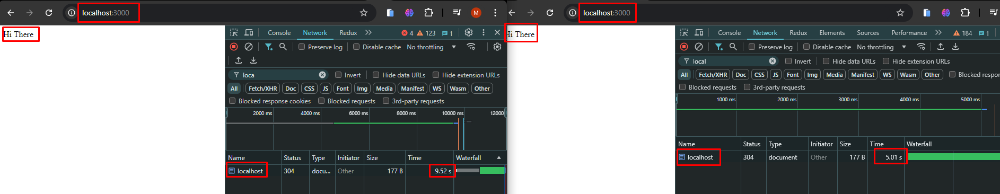

# Cluster Mode Performance Enhancement in Node.js
We can not make node to use multiple threads, but we can make multiple copies of the same application to run on 
different cores of the CPU. This way we can utilize the full potential of the CPU and enhance the performance of the 
application. In cluster mode of Node.js, multiple copy of the same application runs on different cores of the CPU. This 
is done to utilize the full potential of the CPU and to enhance the performance of the application. In this article, we 
will discuss how to enhance the performance of a Node.js application using cluster mode. 

# Worker Threads
Worker thread use the thread pool which is created by libuv. Worker threads are useful for CPU-bound tasks to offload 
the main event loop. 

# Conclusion
Using cluster mode is recommended instead of worker threads for enhancing the performance of a Node.js application. As
cluster mode is more stable and reliable than worker threads also it is easier to implement also battle proven. Worker
thread is more complex and less stable than cluster mode, and also it is experimental.

# Example
```js
const express = require('express');
const app = express();

function doWork(duration) {
    const start = Date.now();
    while(Date.now() - start < duration) {}
}

app.get('/', (req, res) => {
    doWork(5000);
    res.send('Hi There');
});

app.listen(3000);
```
Run those to command to make application ready `npm init`, `npm install express --save` then `node app.js`. Now open
two tabs in browser and hit `http://localhost:3000/` in both tabs.



As we can see I first hit `http://localhost:3000/` tab on the right side then the tab on the left side. So, tab on right
side waiting for the response from the server for the 5 seconds, after the response from right side is received then the
request from left side is started to process. This is because the Node.js is single threaded and it can process only one
request at a time. That's why right one get response at 5.01s and left one get response at 9.52s. Left one waited for the
(9.52 - 5.01 = 4.51) seconds for first request from the right side to complete. Here we are blocking entire event loop 
for 5 seconds that's mean our serve is not able to process any other request during that time.

# References
- [Node JS: Advanced Concepts](https://www.udemy.com/course/advanced-node-for-developers/)