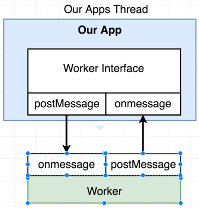

# Worker Threads
Worker thread use the thread pool which is created by libuv. Worker threads are useful for CPU-bound tasks to offload
the main event loop. It is not recommended to use worker threads for I/O-bound tasks because it will not provide any
benefit. Worker threads are useful for tasks that are CPU-bound and can be parallelized. Worker threads are useful for
tasks that can be broken down into smaller tasks and can be executed in parallel.

**webworker-threads** for this package needs to use Node version 10.

`npm i webworker-threads`



[Source](https://www.udemy.com/course/advanced-node-for-developers/)

Worker thread create a new thread outside of our main thread pool for that reason it is out of our main event loop.
It communicates with the main thread using `postMessage` and `onmessage` event. That's why it can do CPU-bound tasks
that's how it can offload the main event loop without blocking it.

```js
const express = require('express');
const crypto = require('crypto');
const app = express();
const Worker = require('webworker-threads').Worker;

app.get('/', (req, res) => {
    //In worker we are only using normal function, so we can't use arrow function
    //Worker is a separate thread, so it doesn't have access to the main thread
    //If we use arrow function, it will try to access the main thread, which is not possible
    const worker = new Worker(function() {
        this.onmessage = function () {
            let counter = 0;
            while(counter < 1e9) {
                counter++;
            }

            postMessage(counter);
        }
    });

    worker.onmessage = function(message) {
        console.log(message.data);
        res.send('' + message.data);
    }

    worker.postMessage();
})

app.get('/fast', (req, res) => {
    res.send('This was fast!');
});

app.listen(3000);
```

# References
- [Node JS: Advanced Concepts](https://www.udemy.com/course/advanced-node-for-developers/)
