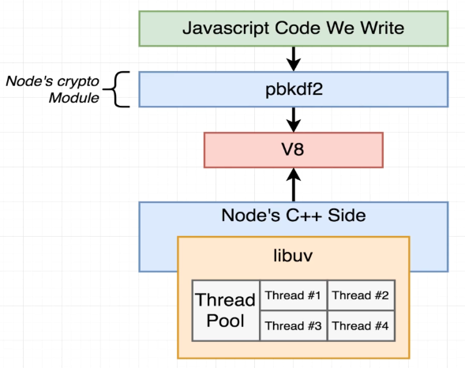

[Source](https://www.udemy.com/course/advanced-node-for-developers/) <br/>

The multithreading for pbkdf2 is handled by the libuv thread pool. The libuv library C++ code is responsible for 
handling the thread pool. The thread pool is used for file system operations, DNS lookups, and other operations that may 
block the event loop. This allows Node.js to perform non-blocking I/O operations even though it is single-threaded. By
default, the thread pool size is 4, but it can be changed using the `UV_THREADPOOL_SIZE` environment variable.


# Node.js Thread Pool and `UV_THREADPOOL_SIZE` = 2

Node.js operates on a single-threaded event loop, but for certain asynchronous tasks (like I/O operations or 
CPU-intensive tasks like encryption), it uses a thread pool in the background to handle these tasks without blocking the
main thread.

## Understanding the Thread Pool

The thread pool is managed by `libuv`, a library that Node.js uses to handle asynchronous operations. By default, 
Node.js allocates a pool of 4 threads to handle asynchronous tasks such as:
- File system operations
- Cryptographic operations (like `crypto.pbkdf2`)
- DNS lookups

### `UV_THREADPOOL_SIZE`

The size of this thread pool can be configured using the `UV_THREADPOOL_SIZE` environment variable. The default size is 
4, but you can increase or decrease it depending on your application's needs. For CPU-bound tasks like `crypto.pbkdf2`, 
a larger pool size can help handle more concurrent tasks.

In this example, you set `process.env.UV_THREADPOOL_SIZE = 2`, meaning only 2 threads are available to handle the
`crypto.pbkdf2` tasks concurrently.

## Example Code

Here's the example you provided:

```javascript
process.env.UV_THREADPOOL_SIZE = 2;

const crypto = require('crypto');

const start = Date.now();
crypto.pbkdf2('a', 'b', 100000, 512, 'sha512', () => {
    console.log('1:', Date.now() - start);
});

crypto.pbkdf2('a', 'b', 100000, 512, 'sha512', () => {
    console.log('2:', Date.now() - start);
});

crypto.pbkdf2('a', 'b', 100000, 512, 'sha512', () => {
    console.log('3:', Date.now() - start);
});

crypto.pbkdf2('a', 'b', 100000, 512, 'sha512', () => {
    console.log('4:', Date.now() - start);
});

crypto.pbkdf2('a', 'b', 100000, 512, 'sha512', () => {
    console.log('5:', Date.now() - start);
});

crypto.pbkdf2('a', 'b', 100000, 512, 'sha512', () => {
    console.log('6:', Date.now() - start);
});

crypto.pbkdf2('a', 'b', 100000, 512, 'sha512', () => {
    console.log('7:', Date.now() - start);
});

crypto.pbkdf2('a', 'b', 100000, 512, 'sha512', () => {
    console.log('8:', Date.now() - start);
});


crypto.pbkdf2('a', 'b', 100000, 512, 'sha512', () => {
    console.log('9:', Date.now() - start);
});

crypto.pbkdf2('a', 'b', 100000, 512, 'sha512', () => {
    console.log('10:', Date.now() - start);
});


crypto.pbkdf2('a', 'b', 100000, 512, 'sha512', () => {
    console.log('11:', Date.now() - start);
});

crypto.pbkdf2('a', 'b', 100000, 512, 'sha512', () => {
    console.log('12:', Date.now() - start);
});

crypto.pbkdf2('a', 'b', 100000, 512, 'sha512', () => {
    console.log('13:', Date.now() - start);
});

crypto.pbkdf2('a', 'b', 100000, 512, 'sha512', () => {
    console.log('14:', Date.now() - start);
});

crypto.pbkdf2('a', 'b', 100000, 512, 'sha512', () => {
    console.log('15:', Date.now() - start);
});

crypto.pbkdf2('a', 'b', 100000, 512, 'sha512', () => {
    console.log('16:', Date.now() - start);
});

crypto.pbkdf2('a', 'b', 100000, 512, 'sha512', () => {
    console.log('17:', Date.now() - start);
});

crypto.pbkdf2('a', 'b', 100000, 512, 'sha512', () => {
    console.log('18:', Date.now() - start);
});


crypto.pbkdf2('a', 'b', 100000, 512, 'sha512', () => {
    console.log('19:', Date.now() - start);
});

crypto.pbkdf2('a', 'b', 100000, 512, 'sha512', () => {
    console.log('20:', Date.now() - start);
});

console.log('Thread Pool Size:', process.env.UV_THREADPOOL_SIZE);
```

## How It Works

1. **Thread Pool Size**: You have set the pool size to `2` (`UV_THREADPOOL_SIZE = 2`). This means that at any given time,
   only `2` threads can be used to execute `crypto.pbkdf2` operations concurrently.
2. **Task Execution**:
    - When the code runs, the first two tasks are immediately executed using the available two threads.
    - The third and subsequent tasks are queued and must wait for one of the two threads to complete its current task.
    - Once a thread becomes free, the next task in the queue is executed, and so on.
3. **Delays in Execution**:
    - Since each task is CPU-intensive, the queue builds up, and tasks take longer to execute as they wait for a thread 
      to become available.
    - The `Date.now()` function captures the start time of the program, and each task logs how long it took since the 
      start time to complete.

### Output Example

For example, the following output shows how the tasks finish over time:

```bash
Thread Pool Size: 2
2: 1086
3: 1095
4: 1096
1: 1165
5: 2142
6: 2185
7: 2198
8: 2242
9: 3039
11: 3165
12: 3171
10: 3175
13: 3988
14: 4182
...
```

### Explanation of Output:
- Tasks 1 and 2 start immediately (since two threads are available).
- Tasks 3 and 4 begin as soon as one of the first two finishes.
- Tasks 5 and onward are queued and must wait for a free thread, resulting in longer delays as the pool processes tasks 
  sequentially.

## Recommendations

- **Increase Thread Pool Size**: For CPU-bound tasks, increasing the thread pool size (e.g., `UV_THREADPOOL_SIZE = 4` or
  higher) can improve throughput by allowing more tasks to be processed concurrently.
- **Consider Asynchronous I/O Operations**: If your application is mostly I/O-bound (file system, network requests), 
  increasing the thread pool size may not provide significant benefits.
- **Monitoring and Scaling**: For optimal performance, monitor how your application's CPU and thread pool are being 
  utilized and scale the thread pool size accordingly.


# Node.js Thread Pool and `UV_THREADPOOL_SIZE` Set to 4

Node.js operates on a single-threaded event loop but uses a thread pool to handle certain asynchronous tasks in the background. The `libuv` library manages this thread pool, and the size of the pool can be configured using the `UV_THREADPOOL_SIZE` environment variable.

## Default and Custom Thread Pool Sizes

- **Default Thread Pool Size**: By default, Node.js allocates a pool of 4 threads.
- **Custom Thread Pool Size**: In the example, you set the thread pool size to 4 (`process.env.UV_THREADPOOL_SIZE = 4`). This allows four `crypto.pbkdf2` operations to run concurrently, with additional tasks being queued until a thread becomes available.

## Example Code

Here is the provided code:

```javascript
process.env.UV_THREADPOOL_SIZE = 4;

const crypto = require('crypto');

const start = Date.now();
crypto.pbkdf2('a', 'b', 100000, 512, 'sha512', () => {
    console.log('1:', Date.now() - start);
});

crypto.pbkdf2('a', 'b', 100000, 512, 'sha512', () => {
    console.log('2:', Date.now() - start);
});

crypto.pbkdf2('a', 'b', 100000, 512, 'sha512', () => {
    console.log('3:', Date.now() - start);
});

crypto.pbkdf2('a', 'b', 100000, 512, 'sha512', () => {
    console.log('4:', Date.now() - start);
});

crypto.pbkdf2('a', 'b', 100000, 512, 'sha512', () => {
    console.log('5:', Date.now() - start);
});

crypto.pbkdf2('a', 'b', 100000, 512, 'sha512', () => {
    console.log('6:', Date.now() - start);
});

crypto.pbkdf2('a', 'b', 100000, 512, 'sha512', () => {
    console.log('7:', Date.now() - start);
});

crypto.pbkdf2('a', 'b', 100000, 512, 'sha512', () => {
    console.log('8:', Date.now() - start);
});


crypto.pbkdf2('a', 'b', 100000, 512, 'sha512', () => {
    console.log('9:', Date.now() - start);
});

crypto.pbkdf2('a', 'b', 100000, 512, 'sha512', () => {
    console.log('10:', Date.now() - start);
});


crypto.pbkdf2('a', 'b', 100000, 512, 'sha512', () => {
    console.log('11:', Date.now() - start);
});

crypto.pbkdf2('a', 'b', 100000, 512, 'sha512', () => {
    console.log('12:', Date.now() - start);
});

crypto.pbkdf2('a', 'b', 100000, 512, 'sha512', () => {
    console.log('13:', Date.now() - start);
});

crypto.pbkdf2('a', 'b', 100000, 512, 'sha512', () => {
    console.log('14:', Date.now() - start);
});

crypto.pbkdf2('a', 'b', 100000, 512, 'sha512', () => {
    console.log('15:', Date.now() - start);
});

crypto.pbkdf2('a', 'b', 100000, 512, 'sha512', () => {
    console.log('16:', Date.now() - start);
});

crypto.pbkdf2('a', 'b', 100000, 512, 'sha512', () => {
    console.log('17:', Date.now() - start);
});

crypto.pbkdf2('a', 'b', 100000, 512, 'sha512', () => {
    console.log('18:', Date.now() - start);
});


crypto.pbkdf2('a', 'b', 100000, 512, 'sha512', () => {
    console.log('19:', Date.now() - start);
});

crypto.pbkdf2('a', 'b', 100000, 512, 'sha512', () => {
    console.log('20:', Date.now() - start);
});

console.log('Thread Pool Size:', process.env.UV_THREADPOOL_SIZE);
```

## How It Works

1. **Thread Pool Size**: Since the thread pool size is set to 4, four `crypto.pbkdf2` operations can run concurrently.

2. **Task Execution**:
    - The first 4 tasks are executed immediately since there are 4 threads available.
    - Tasks 5 onward are queued and must wait for one of the initial tasks to complete before starting.

3. **Effect on Performance**:
    - You will see that the first 4 tasks finish close to each other in terms of time, as they were running concurrently.
    - The next group of tasks (tasks 5 to 8) are processed as soon as a thread becomes available, and so on for the remaining tasks.

## Example Output

Here is an example of the output generated by the script:

```bash
Thread Pool Size: 4
2: 965
4: 970
1: 976
3: 1045
6: 1950
5: 1960
7: 1989
8: 1997
9: 2956
11: 2977
12: 3005
10: 3025
13: 3999
16: 4014
14: 4035
15: 4037
17: 4927
18: 4952
20: 4971
19: 4991
```

### Explanation of Output:

- The first 4 tasks (`1, 2, 3, 4`) start and finish close to each other, as they run concurrently.
- The next 4 tasks (`5, 6, 7, 8`) begin as soon as a thread from the first batch becomes free, which results in a gap of about 1 second.
- Similarly, tasks 9 through 12 are queued and begin when threads become available.
- As you move further down the task queue, delays become apparent as tasks are waiting for available threads.

## Performance Consideration

In this case, setting the `UV_THREADPOOL_SIZE` to 4 allows tasks to be executed in batches of 4. Since `crypto.pbkdf2` is a CPU-bound operation, increasing the thread pool size would allow more tasks to be executed concurrently, but it could also lead to system resource contention (CPU overutilization).

For tasks that are I/O-bound, increasing the thread pool size may not offer significant benefits. However, for CPU-intensive tasks, optimizing the thread pool size based on system resources can improve throughput.

### General Recommendations:
- **Increase Thread Pool Size**: If you are performing CPU-bound tasks like cryptographic operations, consider increasing the thread pool size (`UV_THREADPOOL_SIZE = n`) to handle more tasks concurrently.
- **Monitor Resource Usage**: Increasing the thread pool size may lead to better performance but can also increase CPU usage. It's important to monitor the system's performance and adjust the pool size accordingly.
- **Concurrency and Scalability**: For applications that need to handle a high number of concurrent CPU-bound tasks, balancing the thread pool size with system capacity is crucial to avoid overloading the CPU.

