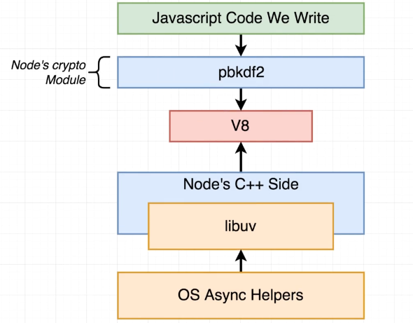

[Source](https://www.udemy.com/course/advanced-node-for-developers/) <br/>

The multithreading for pbkdf2 is handled by the libuv thread pool. The libuv library C++ code is responsible for 
handling the thread pool. The thread pool is used for file system operations, DNS lookups, and other operations that may 
block the event loop. This allows Node.js to perform non-blocking I/O operations even though it is single-threaded. By
default, the thread pool size is 4, but it can be changed using the `UV_THREADPOOL_SIZE` environment variable.


# Node.js Thread Pool and `UV_THREADPOOL_SIZE` = 2

Node.js operates on a single-threaded event loop, but for certain asynchronous tasks (like I/O operations or 
CPU-intensive tasks like encryption), it uses a thread pool in the background to handle these tasks without blocking the
main thread.

## Understanding the Thread Pool

The thread pool is managed by `libuv`, a library that Node.js uses to handle asynchronous operations. By default, 
Node.js allocates a pool of 4 threads to handle asynchronous tasks such as:
- File system operations
- Cryptographic operations (like `crypto.pbkdf2`)
- DNS lookups

### `UV_THREADPOOL_SIZE`

The size of this thread pool can be configured using the `UV_THREADPOOL_SIZE` environment variable. The default size is 
4, but you can increase or decrease it depending on your application's needs. For CPU-bound tasks like `crypto.pbkdf2`, 
a larger pool size can help handle more concurrent tasks.

In this example, you set `process.env.UV_THREADPOOL_SIZE = 2`, meaning only 2 threads are available to handle the
`crypto.pbkdf2` tasks concurrently.

## Example Code

Here's the example you provided:

```javascript
process.env.UV_THREADPOOL_SIZE = 2;

const crypto = require('crypto');

const start = Date.now();
crypto.pbkdf2('a', 'b', 100000, 512, 'sha512', () => {
    console.log('1:', Date.now() - start);
});

crypto.pbkdf2('a', 'b', 100000, 512, 'sha512', () => {
    console.log('2:', Date.now() - start);
});

crypto.pbkdf2('a', 'b', 100000, 512, 'sha512', () => {
    console.log('3:', Date.now() - start);
});

crypto.pbkdf2('a', 'b', 100000, 512, 'sha512', () => {
    console.log('4:', Date.now() - start);
});

crypto.pbkdf2('a', 'b', 100000, 512, 'sha512', () => {
    console.log('5:', Date.now() - start);
});

crypto.pbkdf2('a', 'b', 100000, 512, 'sha512', () => {
    console.log('6:', Date.now() - start);
});

crypto.pbkdf2('a', 'b', 100000, 512, 'sha512', () => {
    console.log('7:', Date.now() - start);
});

crypto.pbkdf2('a', 'b', 100000, 512, 'sha512', () => {
    console.log('8:', Date.now() - start);
});


crypto.pbkdf2('a', 'b', 100000, 512, 'sha512', () => {
    console.log('9:', Date.now() - start);
});

crypto.pbkdf2('a', 'b', 100000, 512, 'sha512', () => {
    console.log('10:', Date.now() - start);
});


crypto.pbkdf2('a', 'b', 100000, 512, 'sha512', () => {
    console.log('11:', Date.now() - start);
});

crypto.pbkdf2('a', 'b', 100000, 512, 'sha512', () => {
    console.log('12:', Date.now() - start);
});

crypto.pbkdf2('a', 'b', 100000, 512, 'sha512', () => {
    console.log('13:', Date.now() - start);
});

crypto.pbkdf2('a', 'b', 100000, 512, 'sha512', () => {
    console.log('14:', Date.now() - start);
});

crypto.pbkdf2('a', 'b', 100000, 512, 'sha512', () => {
    console.log('15:', Date.now() - start);
});

crypto.pbkdf2('a', 'b', 100000, 512, 'sha512', () => {
    console.log('16:', Date.now() - start);
});

crypto.pbkdf2('a', 'b', 100000, 512, 'sha512', () => {
    console.log('17:', Date.now() - start);
});

crypto.pbkdf2('a', 'b', 100000, 512, 'sha512', () => {
    console.log('18:', Date.now() - start);
});


crypto.pbkdf2('a', 'b', 100000, 512, 'sha512', () => {
    console.log('19:', Date.now() - start);
});

crypto.pbkdf2('a', 'b', 100000, 512, 'sha512', () => {
    console.log('20:', Date.now() - start);
});

console.log('Thread Pool Size:', process.env.UV_THREADPOOL_SIZE);
```

## How It Works

1. **Thread Pool Size**: You have set the pool size to `2` (`UV_THREADPOOL_SIZE = 2`). This means that at any given time,
   only `2` threads can be used to execute `crypto.pbkdf2` operations concurrently.
2. **Task Execution**:
    - When the code runs, the first two tasks are immediately executed using the available two threads.
    - The third and subsequent tasks are queued and must wait for one of the two threads to complete its current task.
    - Once a thread becomes free, the next task in the queue is executed, and so on.
3. **Delays in Execution**:
    - Since each task is CPU-intensive, the queue builds up, and tasks take longer to execute as they wait for a thread 
      to become available.
    - The `Date.now()` function captures the start time of the program, and each task logs how long it took since the 
      start time to complete.

### Output Example

For example, the following output shows how the tasks finish over time:

```bash
Thread Pool Size: 2
2: 1086
3: 1095
4: 1096
1: 1165
5: 2142
6: 2185
7: 2198
8: 2242
9: 3039
11: 3165
12: 3171
10: 3175
13: 3988
14: 4182
...
```

### Explanation of Output:
- Tasks 1 and 2 start immediately (since two threads are available).
- Tasks 3 and 4 begin as soon as one of the first two finishes.
- Tasks 5 and onward are queued and must wait for a free thread, resulting in longer delays as the pool processes tasks 
  sequentially.


# Node.js Thread Pool and `UV_THREADPOOL_SIZE` Set to 4

Node.js operates on a single-threaded event loop but uses a thread pool to handle certain asynchronous tasks in the 
background. The `libuv` library manages this thread pool, and the size of the pool can be configured using the 
`UV_THREADPOOL_SIZE` environment variable.

## Default and Custom Thread Pool Sizes

- **Default Thread Pool Size**: By default, Node.js allocates a pool of 4 threads.
- **Custom Thread Pool Size**: In the example, you set the thread pool size to 4 (`process.env.UV_THREADPOOL_SIZE = 4`).
  This allows four `crypto.pbkdf2` operations to run concurrently, with additional tasks being queued until a thread
  becomes available.

## Example Code

Here is the provided code:

```javascript
process.env.UV_THREADPOOL_SIZE = 4;

const crypto = require('crypto');

const start = Date.now();
crypto.pbkdf2('a', 'b', 100000, 512, 'sha512', () => {
    console.log('1:', Date.now() - start);
});

crypto.pbkdf2('a', 'b', 100000, 512, 'sha512', () => {
    console.log('2:', Date.now() - start);
});

crypto.pbkdf2('a', 'b', 100000, 512, 'sha512', () => {
    console.log('3:', Date.now() - start);
});

crypto.pbkdf2('a', 'b', 100000, 512, 'sha512', () => {
    console.log('4:', Date.now() - start);
});

crypto.pbkdf2('a', 'b', 100000, 512, 'sha512', () => {
    console.log('5:', Date.now() - start);
});

crypto.pbkdf2('a', 'b', 100000, 512, 'sha512', () => {
    console.log('6:', Date.now() - start);
});

crypto.pbkdf2('a', 'b', 100000, 512, 'sha512', () => {
    console.log('7:', Date.now() - start);
});

crypto.pbkdf2('a', 'b', 100000, 512, 'sha512', () => {
    console.log('8:', Date.now() - start);
});


crypto.pbkdf2('a', 'b', 100000, 512, 'sha512', () => {
    console.log('9:', Date.now() - start);
});

crypto.pbkdf2('a', 'b', 100000, 512, 'sha512', () => {
    console.log('10:', Date.now() - start);
});


crypto.pbkdf2('a', 'b', 100000, 512, 'sha512', () => {
    console.log('11:', Date.now() - start);
});

crypto.pbkdf2('a', 'b', 100000, 512, 'sha512', () => {
    console.log('12:', Date.now() - start);
});

crypto.pbkdf2('a', 'b', 100000, 512, 'sha512', () => {
    console.log('13:', Date.now() - start);
});

crypto.pbkdf2('a', 'b', 100000, 512, 'sha512', () => {
    console.log('14:', Date.now() - start);
});

crypto.pbkdf2('a', 'b', 100000, 512, 'sha512', () => {
    console.log('15:', Date.now() - start);
});

crypto.pbkdf2('a', 'b', 100000, 512, 'sha512', () => {
    console.log('16:', Date.now() - start);
});

crypto.pbkdf2('a', 'b', 100000, 512, 'sha512', () => {
    console.log('17:', Date.now() - start);
});

crypto.pbkdf2('a', 'b', 100000, 512, 'sha512', () => {
    console.log('18:', Date.now() - start);
});


crypto.pbkdf2('a', 'b', 100000, 512, 'sha512', () => {
    console.log('19:', Date.now() - start);
});

crypto.pbkdf2('a', 'b', 100000, 512, 'sha512', () => {
    console.log('20:', Date.now() - start);
});

console.log('Thread Pool Size:', process.env.UV_THREADPOOL_SIZE);
```

## How It Works

1. **Thread Pool Size**: Since the thread pool size is set to 4, four `crypto.pbkdf2` operations can run concurrently.

2. **Task Execution**:
    - The first 4 tasks are executed immediately since there are 4 threads available.
    - Tasks 5 onward are queued and must wait for one of the initial tasks to complete before starting.

3. **Effect on Performance**:
    - You will see that the first 4 tasks finish close to each other in terms of time, as they were running concurrently.
    - The next group of tasks (tasks 5 to 8) are processed as soon as a thread becomes available, and so on for the
      remaining tasks.

## Example Output

Here is an example of the output generated by the script:

```bash
Thread Pool Size: 4
2: 965
4: 970
1: 976
3: 1045
6: 1950
5: 1960
7: 1989
8: 1997
9: 2956
11: 2977
12: 3005
10: 3025
13: 3999
16: 4014
14: 4035
15: 4037
17: 4927
18: 4952
20: 4971
19: 4991
```

### Explanation of Output:

- The first 4 tasks (`1, 2, 3, 4`) start and finish close to each other, as they run concurrently.
- The next 4 tasks (`5, 6, 7, 8`) begin as soon as a thread from the first batch becomes free, which results in a gap of
  about 1 second.
- Similarly, tasks 9 through 12 are queued and begin when threads become available.
- As you move further down the task queue, delays become apparent as tasks are waiting for available threads.

## Performance Consideration

In this case, setting the `UV_THREADPOOL_SIZE` to 4 allows tasks to be executed in batches of 4. Since `crypto.pbkdf2` 
is a CPU-bound operation, increasing the thread pool size would allow more tasks to be executed concurrently, but it 
could also lead to system resource contention (CPU overutilization).

For tasks that are I/O-bound, increasing the thread pool size may not offer significant benefits. However, for 
CPU-intensive tasks, optimizing the thread pool size based on system resources can improve throughput.

## Performance Considerations

1. **Increase Thread Pool Size**: For CPU-bound tasks (e.g., cryptographic functions), increasing the thread pool size
   (e.g., `UV_THREADPOOL_SIZE = 4`) can help process more tasks concurrently.
2. **Monitor Resource Usage**: Increasing the thread pool size can lead to higher CPU usage, so it's important to 
   balance the size based on system resources.
3. **Concurrency for I/O-bound Tasks**: For I/O-bound tasks (e.g., file system or network operations), increasing the 
   thread pool size may not provide significant benefits as these tasks are generally less CPU-intensive.

## General Recommendations

- **Use Appropriate Pool Sizes**: Adjust the thread pool size based on the workload and available system resources. For 
  CPU-intensive tasks, a larger pool size can improve throughput.
- **Monitor System Performance**: Keep an eye on CPU and memory usage to ensure that increasing the thread pool size 
  doesn't lead to resource contention.
- **Scale Based on Task Type**: For applications that handle a mix of CPU-bound and I/O-bound tasks, consider using a 
  larger thread pool for CPU-bound tasks while allowing I/O-bound tasks to run as efficiently as possible.

## Thread Task Distribution on CPU Cores
The thread pool in Node.js is managed by the `libuv` library, which handles the distribution of tasks across CPU cores. 
By default, the thread pool size is set to 4, but you can adjust it using the `UV_THREADPOOL_SIZE` environment variable.
Setting the thread pool size to match the number of CPU cores can help optimize task distribution and improve performance.

# Node.js Thread Pool and Its Usage

In Node.js, certain operations can be offloaded to a thread pool to prevent blocking the single-threaded event loop. The
thread pool is mainly used for I/O-bound tasks or CPU-intensive operations. Here's a breakdown of key points regarding
the thread pool:

## 1. Custom JavaScript Code and the Thread Pool
Contrary to the belief that only built-in Node.js functions can utilize the thread pool, we can write custom JavaScript
code that takes advantage of the thread pool. This means that developers have the flexibility to implement operations 
that can run in the background without blocking the event loop.

## 2. Node.js Standard Library Functions that Use the Thread Pool
Several functions in the Node.js standard library make use of the thread pool. Some of the common modules that use the
thread pool are:
- **'fs' module**: Most file system operations, like reading or writing files asynchronously, are delegated to the 
  thread pool.
- **Crypto module**: Certain cryptographic operations are offloaded to the thread pool, especially those that require
  significant processing power.
- **Operating System Differences**: The usage of the thread pool may vary slightly depending on the operating system. 
  For instance, there could be differences in how the thread pool is utilized on Windows versus Unix-based systems.

## 3. Interaction of Thread Pool with the Event Loop
The Node.js event loop is responsible for executing tasks in a non-blocking manner. However, operations running in the 
thread pool are an essential part of this mechanism.
- **Pending Operations**: Tasks running in the thread pool are tracked as 'pendingOperations'. These are operations that
  have been initiated and are currently being processed in the thread pool.
- Once these operations complete, their results are returned to the event loop, and the callback associated with the 
  operation is executed.

By using the thread pool, we can ensure that time-consuming tasks do not block the main thread, thereby maintaining the 
non-blocking nature of Node.js applications.


# Node.js Event Loop and libuv

## Understanding Asynchronous Operations in Node.js

In Node.js, most I/O tasks such as file operations or HTTP requests are asynchronous and non-blocking. This is due to
Node.js’s **single-threaded** architecture, which leverages **libuv** to handle these tasks efficiently. Node.js uses an 
event-driven architecture where operations do not block the main thread. Instead, they delegate tasks to the **libuv** 
library or the OS's asynchronous helpers.

### Key Components
- **JavaScript Code**: This is the code we write. It calls built-in Node.js modules or APIs (like `https` in this case)
  to perform asynchronous operations.
- **Node.js Crypto Module**: For cryptographic operations like `pbkdf2`, Node.js relies on its built-in crypto module.
- **V8 Engine**: V8 compiles JavaScript into machine code. When you call asynchronous functions, V8 forwards them to the 
  underlying Node.js system.
- **Node.js C++ Side**: Node.js is built on C++, and the native C++ side takes care of binding JavaScript to lower-level
  operations.
- **libuv**: This is the event loop manager. It delegates I/O tasks to operating system helpers and manages the 
  completion of async tasks.
- **OS Async Helpers**: These are provided by the operating system (OS). libuv utilizes these helpers to perform tasks 
  such as networking or file I/O.

### Asynchronous HTTP Requests Example

In your example, you're making 7 asynchronous HTTP requests to Google using the `https` module.

```javascript
const https = require('https');

const start = Date.now();

function doRequest () {
    https.request('https://www.google.com', res => {
        res.on('data', () => {});
        res.on('end', () => {
            console.log(Date.now() - start);
        });
    }).end();
}

doRequest();
doRequest();
doRequest();
doRequest();
doRequest();
doRequest();
doRequest();
```

When you run this code with `node test2.js`, you’ll see output similar to this:
```
859
1003
1013
1023
1034
1049
1130
```
These numbers represent the time (in milliseconds) taken by each request to complete. Notice how the requests don’t take 
exactly the same amount of time. This demonstrates the non-blocking nature of Node.js: while one request is being
processed, others can proceed simultaneously, showing concurrency.

### How It Works

#### JavaScript Call
When `doRequest()` is invoked, Node.js executes the `https.request()` method.
#### libuv Delegation
Since this is an I/O task, the request is delegated to **libuv** and **OS-level asynchronous helpers**. Operating system
take decisions on how to handle the request, does it need to be sent over the network, does need new thread, etc.
#### Event Loop
Node.js’s event loop keeps running and does not block while waiting for the response. Once a response is received, the
event loop is notified, and the `data` and `end` events are triggered.
#### Timing
The difference in the numbers printed by `console.log(Date.now() - start)` represents how long each request took to
complete.

### Diagram of Execution Flow

The diagram below shows the overall flow of how Node.js handles the asynchronous requests with the help of **libuv** and 
OS helpers:



This showcases how an HTTPS request moves from our JavaScript code, through Node's C++ side, down to libuv, and 
eventually the OS.

### Conclusion
- Node.js utilizes **libuv** to delegate asynchronous tasks like HTTP requests to the operating system, freeing up the 
  main event loop.
- Requests complete at slightly different times due to network factors, but Node.js handles them concurrently without 
  blocking.
- Node std library modules like `https` use almost everything around networking from OS level, libuv, and V8 engine to 
  handle asynchronous operations.
- Async operations use and pendingOperations to manage tasks and their completion. This allows Node.js to 
  handle multiple tasks concurrently without blocking the main thread.

This is a powerful model that allows Node.js to handle a large number of I/O operations efficiently, making it suitable 
for building scalable, real-time applications.

