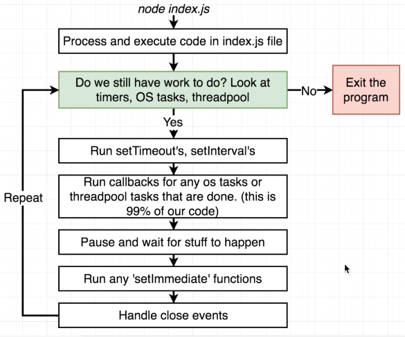
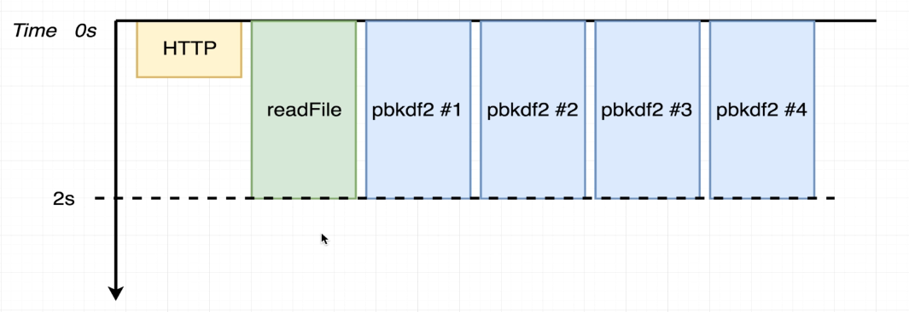
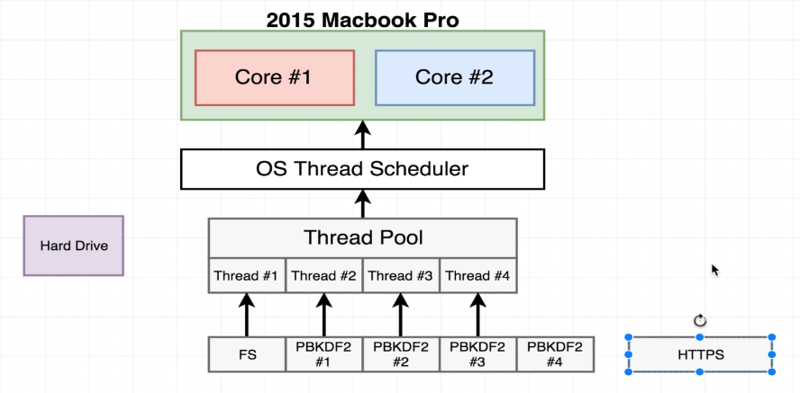
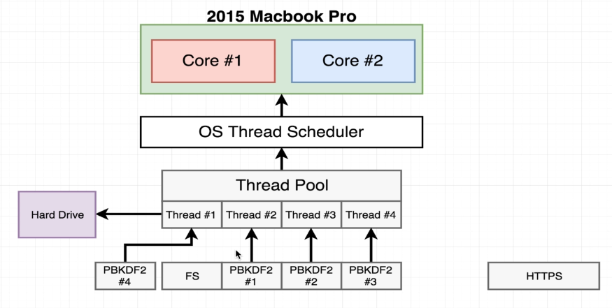
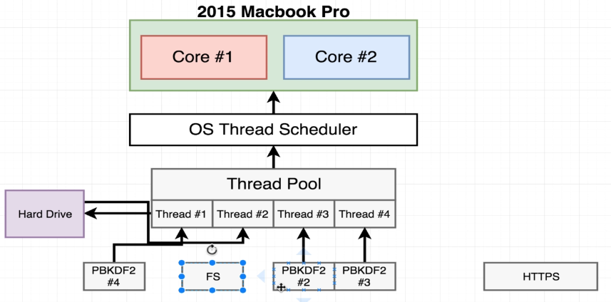

# Node.js Event Loop JavaScript Code Execution Flow

## 1. Initialize Project

- The Node.js runtime starts, initializing necessary resources like memory, V8 engine, and the event loop.

## 2. Execute Top-Level Code (Synchronous Code First)

- Node.js runs all synchronous code in the main module (e.g., `console.log()`, function definitions, variable declarations, etc.).
- **Important:** This happens **before** any asynchronous operations (like `setTimeout`, `setImmediate`, `fs.readFile`) execute.

## 3. Require Modules (`require()` / `import`)

- If `require('module')` is encountered, Node.js:
   - Checks if the module is cached.
   - If not, loads, compiles, and executes it synchronously before continuing execution.

## 4. Register Event Callbacks & Asynchronous Operations

- Asynchronous operations like:
   - `setTimeout()`, `setImmediate()`, `setInterval()`
   - `fs.readFile()`, `process.nextTick()`
   - `Promise.then()`, `queueMicrotask()`
- These register callbacks for execution in later event loop phases.

## 5. Start the Event Loop and Thread Pool (if required)

- The event loop begins processing registered tasks in different **phases**:

### Phases of the Event Loop

The event loop is divided into several phases, each responsible for handling specific types of tasks. The diagram
provided shows the general flow of the event loop and how it manages asynchronous tasks.

```shell
   ┌───────────────────────────┐
┌─>│           timers          │<─ expired timers callbacks like setTimeout, setInterval
│  └─────────────┬─────────────┘  
│  ┌─────────────┴─────────────┐   
│  │     pending callbacks     │<─ I/O success callback will be executed here
│  └─────────────┬─────────────┘
│  ┌─────────────┴─────────────┐
│  │       idle, prepare       │<─ only used internally
│  └─────────────┬─────────────┘      
│  ┌─────────────┴─────────────┐   retrieve new I/O events; execute I/O related callbacks (almost all with the exception   
│  │           poll            │<─ of close callbacks, the ones scheduled by timers, and setImmediate)
│  └─────────────┬─────────────┘     
│  ┌─────────────┴─────────────┐      
│  │           check           │<─ execute setImmediate() callbacks
│  └─────────────┬─────────────┘ 
│  ┌─────────────┴─────────────┐
└──┤      close callbacks      │<─ some close callbacks, e.g. socket.on('close', ...)
   └───────────────────────────┘
```

timers, pending callbacks, idle, prepare, poll, check, close callbacks each one are called phases of the event loop.
Promise callback are executed at the phase transition between poll and check phase.

### Detailed Flow

1. **(Main Script Execution) Process and execute code in index.js file**
   - **Phase:** Top-level execution
   - The event loop starts by executing the code in the index.js file (or any other entry point).
   - This is typically where you write your application logic, including any asynchronous functions like `setTimeout`,
     `setInterval`, or I/O operations.

2. **(Timers Phase) Check for pending work (Timers, OS Tasks, Threadpool)**
   - **Phase:** Timers
   - After the code is executed, the event loop checks whether there are still tasks to process. These tasks could
     include:
      - **Timers**: Registered through `setTimeout` or `setInterval`.
      - **OS Tasks**: Tasks such as server listening or incoming network connections.
      - **Threadpool Tasks**: File system operations or cryptographic operations handled by the thread pool.

3. **(Timers Phase) Run setTimeout's, setInterval's**
   - **Phase:** Timers
   - If there are any timers (such as `setTimeout` or `setInterval`) that are due, their callbacks are executed in this
     phase.

4. **(Pending Callbacks Phase) Run callbacks for any OS tasks or threadpool tasks**
   - **Phase:** Pending callbacks
   - This is where most of the I/O or computational callbacks are processed. For instance:
      - File I/O operations (reading or writing to disk).
      - Incoming network requests.
      - Database queries.
   - This phase processes the majority of asynchronous tasks that are queued.

5. **(Idle, Prepare Phase) Internal operations**
   - **Phase:** Idle, Prepare
   - These phases are used internally by Node.js and are generally not visible to developers.
   - They allow the system to prepare for the next polling phase.

6. **(Poll Phase) Retrieve new I/O events**
   - **Phase:** Poll
   - In this phase, the event loop retrieves new I/O events and executes I/O-related callbacks (except those for timers
     or `setImmediate`).
   - If there are no pending I/O events, the loop will wait for new events or move to the next phase.

7. **(Check Phase) Run 'setImmediate' functions**
   - **Phase:** Check
   - If there are any `setImmediate()` callbacks scheduled, they are executed in this phase. The `setImmediate`
     function is used to execute a callback immediately after I/O events are processed.

8. **(Close Callbacks Phase) Handle close events**
   - **Phase:** Close Callbacks
   - In this phase, the event loop handles any close events. For example, when a server or socket closes, this phase
     ensures the cleanup of resources.

9. **Repeat**
   - The event loop repeats this cycle continuously, processing new tasks as they are added to the queue.

10. **Exit the program**
- The event loop will exit when there are no more tasks to process (timers, OS tasks, threadpool tasks). At this
  point, the program terminates.

### Key Example: `setTimeout` vs `setImmediate`

```javascript
setTimeout(function () {
    console.log('setTimeout');
}, 0);

setImmediate(function () {
    console.log('setImmediate');
});
```

- Here, `setTimeout` and `setImmediate` are not guaranteed in which order they will execute. Since there is no 
  synchronous code, both `setTimeout` and `setImmediate` are registered before entering the event loop, and their 
  execution order is not fixed—it depends on system performance and event loop phase scheduling.

- **Why is the order uncertain despite the loop phases?**  Even though the *Timers phase* comes before the *Check phase*
  in the event loop's *conceptual* diagram, the exact timing is heavily influenced by the *poll phase*.  The poll phase
  retrieves new I/O events.  If the poll phase becomes idle (no I/O events) *before* the timer expires (even if it's a 
  0ms timeout), the event loop *might* immediately jump to the check phase to execute `setImmediate` callbacks.  
  Conversely, if the system clock "ticks over" and the 0ms timer expires *during* the poll phase (before it becomes 
  idle), the `setTimeout` callback will be executed in the *Timers phase* of that iteration of the loop.  In essence, 
  both callbacks are "ready" very quickly, and the slight timing variations in system processes determine which one 
  gets picked up first.

- In the context of a file system operation inside poll phase, setImmediate will be called when the I/O operation is 
  completed.

```javascript
setTimeout(function () {
    console.log('setTimeout');
}, 0);

setImmediate(function () {
    console.log('setImmediate');
});

console.log('1');
```

- **Execution Analysis:**

   1.  *Initial Phase (Before Event Loop):* The Node.js runtime encounters `setTimeout` and `setImmediate`.  It registers the callbacks associated with these functions to be executed later. The `setTimeout` callback is placed in the timers queue and the `setImmediate` callback is placed in the check queue.
   2.  *Synchronous Execution:*  `console.log('1')` is executed *immediately* because it's synchronous code.  Therefore, "1" is the *first* thing printed to the console.
   3.  *Event Loop Begins:* The event loop starts its phases.
   4.  *Timers Phase:* The event loop enters the timers phase. The timer for `setTimeout` has likely expired (or is about to, given the 0ms delay). The `setTimeout` callback is executed, resulting in `console.log('setTimeout')` being called, and "setTimeout" is printed to the console.
   5.  *Poll Phase:* The event loop enters the poll phase.  If there are any I/O events, they are processed here.  If the poll phase becomes idle, the loop might directly move to the check phase.
   6.  *Check Phase:*  The event loop enters the check phase.  The `setImmediate` callback is executed, resulting in `console.log('setImmediate')` being called, and "setImmediate" is printed to the console.

- *Outcome:* As a result of this process, you'll generally see the following output order:

    ```
    1
    setTimeout
    setImmediate
    ```
  This order is typical, but, as noted before, system variations can sometimes cause `setImmediate` to execute before `setTimeout` if the timer doesn't expire before the poll phase becomes idle.


```js
const fs = require('fs');

setTimeout(() => console.log('Hello from Timer 1'), 0);

setImmediate(() => console.log('Hello from Immediate 1'));

fs.readFile('sample.txt', () => {
    console.log('IO Polling Finished');
});

console.log('Hello from the top-level code');
```
Output
```shell
$ node test.js
Hello from the top-level code
Hello from Timer 1
Hello from Immediate 1
IO Polling Finished
```

First the top-level code is executed, then the timer callback is executed, followed by the immediate callback. The file
system operation is completed last also I/O operations most of the time take more time than timers and immediates.


```js
const fs = require('fs');

setTimeout(() => console.log('Hello from Timer 1'), 0);

setImmediate(() => console.log('Hello from Immediate 1'));

fs.readFile('sample.txt', () => {
    console.log('IO Polling Finished');

    setTimeout(() => console.log('Hello from Timer 2'), 0);
    setTimeout(() => console.log('Hello from Timer 3'), 5 * 1000);
    setImmediate(() => console.log('Hello from Immediate Fn 2'));
});

console.log('Hello from the top-level code');
```
Output
```shell
$ node test.js
Hello from the top-level code
Hello from Timer 1
Hello from Immediate 1
IO Polling Finished
Hello from Immediate Fn 2
Hello from Timer 2
Hello from Timer 3
```

First the top-level code is executed and the `console.log` "Hello from the top-level code" is printed and will register
`setTimeout` and `setImmediate` callbacks and I/O operation. At the first loop first as the first `setTimeout` is
expired it will print "Hello from Timer 1" then the `setImmediate` callback is executed and print "Hello from Immediate
1". Then the I/O operation is completed and print "IO Polling Finished". Then the two `setTimeout` will be registered
and the `setImmediate` callback is executed and print "Hello from Immediate Fn 2". Then at next event loop iteration the
first `setTimeout` will be executed and print "Hello from Timer 2" and then after several event loop iteration the when
the second `setTimeout` is expired it will print "Hello from Timer 3".


```js
const fs = require('fs');
const crypto = require('crypto');

const start = Date.now();

setTimeout(() => console.log('Hello from Timer 1'), 0);

setImmediate(() => console.log('Hello from Immediate 1'));

fs.readFile('sample.txt', () => {
    console.log('IO Polling Finished');

    setTimeout(() => console.log('Hello from Timer 2'), 0);
    setTimeout(() => console.log('Hello from Timer 3'), 5 * 1000);
    setImmediate(() => console.log('Hello from Immediate Fn 2'));

    // CPU Intensive Task
    crypto.pbkdf2('password1', 'salt1', 100000, 1024, 'sha512', () => {
        console.log(`${Date.now() -start} Password 1 Done`);
    });

    crypto.pbkdf2('password2', 'salt1', 100000, 1024, 'sha512', () => {
        console.log(`${Date.now() -start} Password 2 Done`);
    });

    crypto.pbkdf2('password3', 'salt1', 100000, 1024, 'sha512', () => {
        console.log(`${Date.now() -start} Password 3 Done`);
    });

    crypto.pbkdf2('password4', 'salt1', 100000, 1024, 'sha512', () => {
        console.log(`${Date.now() -start} Password 4 Done`);
    });
});

console.log('Hello from the top-level code');
```
Output
```shell
$ node test.js
Hello from the top-level code
Hello from Timer 1
Hello from Immediate 1
IO Polling Finished
Hello from Immediate Fn 2
Hello from Timer 2
3434 Password 3 Done
3657 Password 1 Done
3664 Password 2 Done
3721 Password 4 Done
Hello from Timer 3
```

`crypto.pbkdf2` is a CPU intensive task. So, it will be handled by the threadpool.By default, its size is 4. So, the
4 encryption will be finished at the same time. 


```shell
const fs = require('fs');
const crypto = require('crypto');

const start = Date.now();

setTimeout(() => console.log('Hello from Timer 1'), 0);

setImmediate(() => console.log('Hello from Immediate 1'));

fs.readFile('sample.txt', () => {
    console.log('IO Polling Finished');

    setTimeout(() => console.log('Hello from Timer 2'), 0);
    setTimeout(() => console.log('Hello from Timer 3'), 5 * 1000);
    setImmediate(() => console.log('Hello from Immediate Fn 2'));

    // CPU Intensive Task
    crypto.pbkdf2('password1', 'salt1', 100000, 1024, 'sha512', () => {
        console.log(`${Date.now() -start} Password 1 Done`);
    });

    crypto.pbkdf2('password2', 'salt1', 100000, 1024, 'sha512', () => {
        console.log(`${Date.now() -start} Password 2 Done`);
    });

    crypto.pbkdf2('password3', 'salt1', 100000, 1024, 'sha512', () => {
        console.log(`${Date.now() -start} Password 3 Done`);
    });

    crypto.pbkdf2('password4', 'salt1', 100000, 1024, 'sha512', () => {
        console.log(`${Date.now() -start} Password 4 Done`);
    });

    crypto.pbkdf2('password5', 'salt1', 100000, 1024, 'sha512', () => {
        console.log(`${Date.now() -start} Password 5 Done`);
    })

    crypto.pbkdf2('password6', 'salt1', 100000, 1024, 'sha512', () => {
        console.log(`${Date.now() -start} Password 6 Done`);
    })
});

console.log('Hello from the top-level code');
```
Output
```shell
$ node test.js
Hello from the top-level code
Hello from Timer 1
Hello from Immediate 1
IO Polling Finished
Hello from Immediate Fn 2
Hello from Timer 2
3482 Password 1 Done
3517 Password 3 Done
3582 Password 2 Done
3608 Password 4 Done
Hello from Timer 3
5258 Password 5 Done
5299 Password 6 Done
```
As thread size is 4 so the first 4 encryption will be finished at the same time. Then the next 2 encryption will be
finished at the same time. 

```shell
const fs = require('fs');
const crypto = require('crypto');

const start = Date.now();
process.env.UV_THREADPOOL_SIZE = 2;

setTimeout(() => console.log('Hello from Timer 1'), 0);

setImmediate(() => console.log('Hello from Immediate 1'));

fs.readFile('sample.txt', () => {
    console.log('IO Polling Finished');

    setTimeout(() => console.log('Hello from Timer 2'), 0);
    setTimeout(() => console.log('Hello from Timer 3'), 5 * 1000);
    setImmediate(() => console.log('Hello from Immediate Fn 2'));

    // CPU Intensive Task
    crypto.pbkdf2('password1', 'salt1', 100000, 1024, 'sha512', () => {
        console.log(`${Date.now() -start} Password 1 Done`);
    });

    crypto.pbkdf2('password2', 'salt1', 100000, 1024, 'sha512', () => {
        console.log(`${Date.now() -start} Password 2 Done`);
    });

    crypto.pbkdf2('password3', 'salt1', 100000, 1024, 'sha512', () => {
        console.log(`${Date.now() -start} Password 3 Done`);
    });

    crypto.pbkdf2('password4', 'salt1', 100000, 1024, 'sha512', () => {
        console.log(`${Date.now() -start} Password 4 Done`);
    });

    crypto.pbkdf2('password5', 'salt1', 100000, 1024, 'sha512', () => {
        console.log(`${Date.now() -start} Password 5 Done`);
    })

    crypto.pbkdf2('password6', 'salt1', 100000, 1024, 'sha512', () => {
        console.log(`${Date.now() -start} Password 6 Done`);
    })
});

console.log('Hello from the top-level code');
```
Output
```shell
$ node test.js
Hello from the top-level code
Hello from Timer 1
Hello from Immediate 1
IO Polling Finished
Hello from Immediate Fn 2
Hello from Timer 2
1786 Password 2 Done
1800 Password 1 Done
3580 Password 3 Done
3675 Password 4 Done
Hello from Timer 3
5442 Password 5 Done
5519 Password 6 Done
```
If we reduce the thread size to 2 then all the encryption will be done in pair. So consecutive 2 encryption will be done
at the same time.


### `process.nextTick()` and `Promises` in the Event Loop
Apart from these phases there is also `process.nextTick()` and promise callback which has the highest priority in the 
event loop. It executes after every phase before moving to the next phase.

* `process.nextTick()` callbacks are always executed before the event loop moves to the next phase.
* Resolved `Promise callbacks are processed immediately after process.nextTick().


```js
setImmediate(() => {
   console.log("setImmediate is called");
});

Promise.resolve("Promise is resolved").then(console.log);

setTimeout(() => {
   console.log("Time function is called");
}, 0);

process.nextTick(() => {
   console.log("Process.nextTick");
});

queueMicrotask(() => {
   console.log("Microtask");
});

console.log("From Top Level");
```

Output
```shell
From Top Level
Process.nextTick
Promise is resolved
Microtask
Time function is called
setImmediate is called
```
In this example

* "From Top Level" is printed first because it is synchronous code.
* `process.nextTick()` executes before moving to the next phase, at the beginning of the event loop.
* Resolved Promises execute right after `process.nextTick()`.
* `queueMicrotask()` executes after Promises.
* `setTimeout()` executes in the timers phase.
* `setImmediate()` executes in the check phase.


### Use case of `process.nextTick()`

```js
const fs = require('fs');

function fileSize(fileName, cb) {
    if (typeof fileName !== 'string') {
        return cb(new TypeError('argument should be string'));
    }

    fs.stat(fileName, (err, stats) => {
        if (err) {
            return cb(err);
        }
        cb(null, stats.size);
    });
}

fileSize(__filename, (err, size) => {
    if (err) throw err;

    console.log(`Size in KB: ${size / 1024}`);
});

console.log('Hello!');
```
Output
```shell
$ node test.js
Hello!
Size in KB: 0.4365234375
```

`Hello` getting printed first as `fs` is an asynchronous operation. So, it will take some time to get the file size.
So we can say `fileSize` is an asynchronous function. BUT IT IS WRONG. If we send wrong filename to ths function it will
throw an error immediately from this line `return cb(new TypeError('argument should be string'));` that's why `Hello`
will not be printed.

```js
const fs = require('fs');

function fileSize(fileName, cb) {
    if (typeof fileName !== 'string') {
        return cb(new TypeError('argument should be string'));
    }

    fs.stat(fileName, (err, stats) => {
        if (err) {
            return cb(err);
        }
        cb(null, stats.size);
    });
}

fileSize(1, (err, size) => {
    if (err) throw err;

    console.log(`Size in KB: ${size / 1024}`);
});

console.log('Hello!');
```

Output
```shell
$ node test.js
<dirname>/test.js:17
    if (err) throw err;
             ^

TypeError: argument should be string
    at fileSize (<dirname>/test.js:5:19)
    at Object.<anonymous> (<dirname>/test.js:16:1)
    at Module._compile (node:internal/modules/cjs/loader:1358:14)
    at Module._extensions..js (node:internal/modules/cjs/loader:1416:10)
    at Module.load (node:internal/modules/cjs/loader:1208:32)
    at Module._load (node:internal/modules/cjs/loader:1024:12)
    at Function.executeUserEntryPoint [as runMain] (node:internal/modules/run_main:174:12)
    at node:internal/main/run_main_module:28:49

Node.js v20.15.1
```

Now `fileSize` function behaves like asynchronous function when the filename is correct and behaves like synchronous
function when the filename is incorrect. So, we can make it completely asynchronous by using `process.nextTick()`.

```js
const fs = require('fs');

function fileSize(fileName, cb) {
    if (typeof fileName !== 'string') {
        return process.nextTick(
            cb,
            new TypeError('argument should be string')
        );
    }

    fs.stat(fileName, (err, stats) => {
        if (err) {
            return cb(err);
        }
        cb(null, stats.size);
    });
}

fileSize(1, (err, size) => {
    if (err) throw err;

    console.log(`Size in KB: ${size / 1024}`);
});

console.log('Hello!');
```
Output
```shell
$ node test.js
Hello!
/media/jahid/SSD_Remaining/1.In Github as Single Project/WEB/NodeJs-Note/test.js:20
    if (err) throw err;
             ^

TypeError: argument should be string
    at fileSize (/media/jahid/SSD_Remaining/1.In Github as Single Project/WEB/NodeJs-Note/test.js:7:13)
    at Object.<anonymous> (/media/jahid/SSD_Remaining/1.In Github as Single Project/WEB/NodeJs-Note/test.js:19:1)
    at Module._compile (node:internal/modules/cjs/loader:1358:14)
    at Module._extensions..js (node:internal/modules/cjs/loader:1416:10)
    at Module.load (node:internal/modules/cjs/loader:1208:32)
    at Module._load (node:internal/modules/cjs/loader:1024:12)
    at Function.executeUserEntryPoint [as runMain] (node:internal/modules/run_main:174:12)
    at node:internal/main/run_main_module:28:49

Node.js v20.15.1
```

Now if there `filename` function is always is asynchronous.


## **Refined Execution Order**

### Key Points

- **Non-blocking I/O**: The event loop is what enables Node.js to perform non-blocking I/O operations, which makes
  Node.js highly efficient for I/O-heavy tasks.
- **Phases**: Each phase of the event loop has a specific role, and the callbacks are processed accordingly.
- **setTimeout vs setImmediate**: `setTimeout` schedules tasks to be run after a specified delay, while `setImmediate` 
  schedules tasks to run immediately after I/O callbacks.

This model allows Node.js to handle multiple operations concurrently, without needing to create additional threads for
each task.

### Diagram of Execution Flow

The diagram below shows the flow of the event loop and the sequence in which tasks are processed:



[Source](https://www.udemy.com/course/advanced-node-for-developers/) <br/>

Understanding the event loop is crucial to writing efficient asynchronous code in Node.js.


# NodeJs File Read Operation
* We invoke the `fs.readFile()` function with the file name and the encoding type.
* Node get some statistics on the file from the file system, require hard drive(like file size, etc) access.
* **Hard drive access is done by the threadpool, statistics are returned to the event loop.**
* Node requests to read the file.
* **Hard drive access is done by the threadpool, file content streamed back to app.**
* Node returns the file content to us.

In those two-step we need more time ""Hard drive access is done by the threadpool, statistic are returned to the event
loop", "Hard drive access is done by the threadpool, file content streamed back to app" in those step execution stops
for a while.


# Task Execution Order

```js
const https = require('https');
const crypto = require('crypto');
const fs = require('fs');

const start = Date.now();

function doRequest () {
    https.request('https://www.google.com', res => {
        res.on('data', () => {});
        res.on('end', () => {
            console.log('HTTP Request:', Date.now() - start);
        });
    }).end();
}

function doHash() {
    crypto.pbkdf2('a', 'b', 100000, 512, 'sha512', () => {
        console.log('Hash:', Date.now() - start);
    });
}

doRequest();

fs.readFile('test2.js', 'utf8', () => {
    console.log('FS:', Date.now() - start);
})

doHash();
doHash();
doHash();
doHash();
```
Output while run the node code with `node test2.js` command:
```
HTTP Request: 778
Hash: 1058
FS: 1059
Hash: 1074
Hash: 1084
Hash: 1152
```



[Source](https://www.udemy.com/course/advanced-node-for-developers/)

In NodeJs it use threadpool for some of the operations like file **system operations or cryptographic operations. The
threadpool is used to handle blocking operations that may otherwise block the event loop**. And for some other operation
like **HTTP requests, timers, and I/O operations, the event loop is used**. Which is handle by OS.

HTTP request is handled by the OS, so it's not handled by the threadpool. So, it's not blocking the event loop. That's 
why the HTTP request is completed first. Then the file system operation is completed. And then the hashing functions and
file read operations are handled by the threadpool. Normally, file read does not take much time. But the hashing functions
are CPU intensive operations. So, both of them are handled by the threadpool. That's why the hashing and file read 
operations are completed almost at the same time.


### Why Always First HTTP Then One Hash Then File Read Then Other Hashes?
Consider the diagram

 

[Source](https://www.udemy.com/course/advanced-node-for-developers/)

The HTTP request is handled by the OS, so it's not handled by the threadpool. It calls the network module in the OS. And
put it at callback queue of event loop and as it do not depends on the threadpool as soon as the response is received it
console exact that time. 

By default nodejs has 4 threads in the threadpool. So, suppose file read operation handled by first thread and then three
hashing functions are handled by other three threads. But, we know for reading file we need time in two steps(mentioned
above). So thread 1 will be realised the file read operation and then it will be free. Remaining one hasing function will
be assigned to thread 1. Meanwhile, thread 2, 3, 4 will continue with hashing functions. 



[Source](https://www.udemy.com/course/advanced-node-for-developers/)

Meanwhile, hashing from any thread 2, 3, or 4 will be completed first it will console after the HTTP request. Then one
thread will be free it will be assigned to file read operation again. In this case suppose thread 2 will be free and
will assign the file read operation.



[Source](https://www.udemy.com/course/advanced-node-for-developers/)

In the mean time hard disk access and statistics of the file will be done so it will returned and will get the time 
printed in the console. Then the remaining hashing functions will be completed and will be printed in the console. Thats
why the output is always HTTP request first, then one hashing function, then file read operation, then other hashing
functions like 
```bash
HTTP Request: 782
Hash: 1044
FS: 1045
Hash: 1056
Hash: 1101
Hash: 1111
```

But if we comment the hashing functions, 
```js
const https = require('https');
const crypto = require('crypto');
const fs = require('fs');

const start = Date.now();

function doRequest () {
    https.request('https://www.google.com', res => {
        res.on('data', () => {});
        res.on('end', () => {
            console.log('HTTP Request:', Date.now() - start);
        });
    }).end();
}

function doHash() {
    crypto.pbkdf2('a', 'b', 100000, 512, 'sha512', () => {
        console.log('Hash:', Date.now() - start);
    });
}

doRequest();

fs.readFile('test2.js', 'utf8', () => {
    console.log('FS:', Date.now() - start);
})

// doHash();
// doHash();
// doHash();
// doHash();
```
The output for `node test2.js` command:
```
FS: 56
HTTP Request: 486
```
If we comment the hashing functions, then there will be no CPU intensive operations. So, the file read operation is
completed first. Then the HTTP request is completed. Because the file read operation is handled by the threadpool. And
the HTTP request is handled by the OS. So, the file read operation is completed first. And then the HTTP request is
completed.


### Changing the Threadpool Size
```js
process.env.UV_THREADPOOL_SIZE = 5;

const https = require('https');
const crypto = require('crypto');
const fs = require('fs');

const start = Date.now();

function doRequest () {
    https.request('https://www.google.com', res => {
        res.on('data', () => {});
        res.on('end', () => {
            console.log('HTTP Request:', Date.now() - start);
        });
    }).end();
}

function doHash() {
    crypto.pbkdf2('a', 'b', 100000, 512, 'sha512', () => {
        console.log('Hash:', Date.now() - start);
    });
}

doRequest();

fs.readFile('test2.js', 'utf8', () => {
    console.log('FS:', Date.now() - start);
})

doHash();
doHash();
doHash();
doHash();
```
If we increase the thread pool size then the output will be different. The output for `node test2.js` command:
```
FS: 52
HTTP Request: 319
Hash: 2255
Hash: 2281
Hash: 2283
Hash: 2326
```
As now for file reading we get one dedicated thread and for hashing functions we get 4 threads. So, the file read
operation is completed first. Then the HTTP request is completed. Then the hashing functions are completed. 


If we decrease the thread pool size to `1` then the output will be different. 
```js
process.env.UV_THREADPOOL_SIZE = 1;

const https = require('https');
const crypto = require('crypto');
const fs = require('fs');

const start = Date.now();

function doRequest () {
    https.request('https://www.google.com', res => {
        res.on('data', () => {});
        res.on('end', () => {
            console.log('HTTP Request:', Date.now() - start);
        });
    }).end();
}

function doHash() {
    crypto.pbkdf2('a', 'b', 100000, 512, 'sha512', () => {
        console.log('Hash:', Date.now() - start);
    });
}

doRequest();

fs.readFile('test2.js', 'utf8', () => {
    console.log('FS:', Date.now() - start);
})

doHash();
doHash();
doHash();
doHash();
```
Then the output for `node test2.js` command:
```
HTTP Request: 381
Hash: 1153
Hash: 2269
Hash: 3358
Hash: 4444
FS: 4445
```


# Tick
In nodejs tick means a single iteration of the event loop.

Event loop faces
- Timers Phase
- Idle Phase
- Polling Phase -> setImmediate
- I/O Phase -> setTimeout
- Close Callbacks Phase


## `setInterval`
`setInterval` is a timer function that repeatedly calls a callback after a specified delay. It executes only when the
call stack is empty and the event loop is not busy. This means the callback will be attempted at the specified interval,
but it is not guaranteed to execute exactly on time if the event loop is blocked.

```js
setInterval(function () {
    console.log('setInterval');
}, 1000);
```

In the example above, "setInterval" will be printed at least every 1 second, provided the event loop is not busy. If the
call stack is occupied, execution will be delayed until the stack is clear.

## `setTimeout`
`setTimeout` schedules a callback to be executed once after a specified delay. Similar to setInterval, it will only
execute when the event loop is free.

```js
setTimeout(function () {
    console.log('setTimeout');
}, 1000);
```

## `setImmediate`
`setImmediate` is a timer function that executes a callback at the end of the current event loop cycle, right after I/O
events but before scheduled timers (setTimeout and setInterval).

Unlike `setTimeout(fn, 0)`, which schedules execution in the timers phase, `setImmediate(fn)` schedules execution in the
check phase of the event loop, making it more predictable for executing after I/O operations.

```js
setImmediate(function () {
    console.log('setImmediate');
});
```

### Execution Order:
* `setImmediate` runs before `setTimeout(fn, 0)` because it is executed in the **check phase**, whereas `setTimeout`
  runs in the timers phase.
* However, `process.nextTick` runs even before `setImmediate` because it executes at the end of the current operation,
  before the event loop continues.


## `process.nextTick`
`process.nextTick` schedules a callback to execute immediately after the current synchronous operation completes, before
the event loop continues to the next phase.

```js
process.nextTick(function () {
    console.log('process.nextTick');
});
```

### Key Differences:
* `process.nextTick` runs before any I/O tasks, timers, or even `setImmediate`.
* If used excessively, it can block the event loop because the next tick queue is executed before returning to the event
  loop.


# Resources
* [Node JS: Advanced Concepts]( https://www.udemy.com/course/advanced-node-for-developers/)
* [How NodeJS Works? - You don't Know NodeJS](https://www.youtube.com/watch?v=_eJ6KAb56Gw)