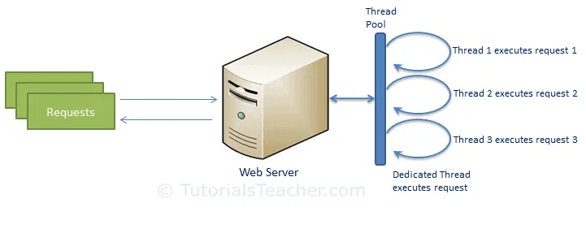
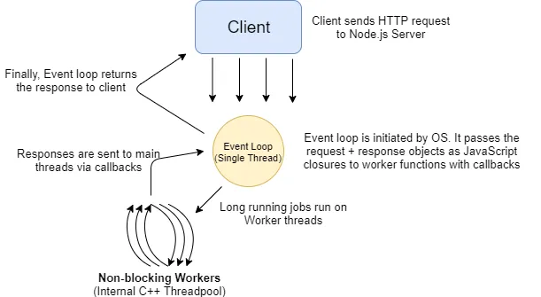

 # The Web Server Model
The traditional web server model consists of a pool of threads which may process requests. Each time a new request comes
in, it is assigned to a different thread in the pool. In the event a request is received and a thread is not available,
the request will have to wait until a previous request finishes, a response is returned, and the thread is returned to
the thread pool. In this way, the web server model is synchronous, or blocking.

[source: TutorialsTeacher](https://www.tutorialsteacher.com/nodejs/nodejs-process-model)

# The Node.js Process Model
The Node.js process model differs from traditional web servers in that Node.js runs in a single process with requests 
being processed on a single thread. One advantage of this is that Node.js requires far fewer resources. When a request 
comes in, it will be placed in an event queue. Node.js uses an event loop to listen for events to be raised for an 
asynchronous job. The event loop continuously runs, receiving requests from the event queue.

There are two scenarios that will occur depending on the nature of the request. 
### Non-Blocking Request
If the request is non-blocking, it does not involve any long-running processes or data requests, the response will be
immediately prepared and then sent back to the client. 

### Blocking Request
In the event the request is blocking, requiring I/O operations, the request will be sent to a worker thread pool. The 
request will have an associated call-back function that will fire when the request is finished and the worker thread can
send the request to the event loop to be sent back to the client. In this way, when the single thread receives a
blocking request, it hands it off so that the thread can process other requests in the meantime. In this way Node.js is 
inherently asynchronous.

[source: Study Tonight](https://www.studytonight.com/post/nodejs-process-model)

The combination of the asynchronous nature of Node.js plus the reduced resource consumption of the single-threaded 
process leads to a significant increase in performance. It should be noted, however, that Node.js does not excel with 
CPU-intensive operations such as image processing and computationally-expensive work.

# References
* [The Node.js Process Model](https://medium.com/@madelinecorman/the-node-js-process-model-ad99a91dd2b8)