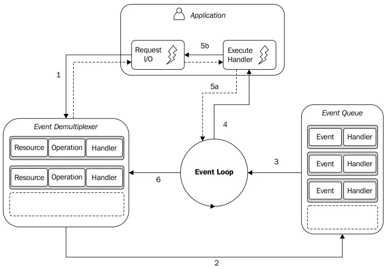

# The Reactor Pattern: An Asynchronous I/O Design

The Reactor Pattern is an advanced design pattern centered around the idea of associating a handler (callback function 
in Node.js) with each Input/Output (I/O) operation. It efficiently handles events in a non-blocking, asynchronous manner,
well-suited for high-performance, event-driven applications like those built with Node.js.

## Core Concepts

* **Handler (Callback Function):** A dedicated function that is executed when a specific I/O operation is completed.
* **Non-Blocking I/O:** The application initiates I/O requests without blocking, allowing it to continue execution while
  waiting for the operation to finish.
* **Event Demultiplexer:** Monitors and manages multiple I/O operations. When operations complete, it forwards the 
  resulting events to the Event Queue. In Node.js, this is often handled by the underlying OS and libuv.
* **Event Queue:** A queue that holds the events generated by the Event Demultiplexer, waiting to be processed by the 
  Event Loop.
* **Event Loop:** Iterates over the Event Queue, invoking the associated handler function for each event. Once the event
  queue is empty, it will block until new events arrives.

## The Reactor Pattern Workflow

[Source](https://medium.com/@mohamed-khattab/demystifying-the-reactor-design-pattern-in-node-js-a8aabd73a315)

1. **Application Initiates I/O:** The application submits a request to the Event Demultiplexer along with a handler 
  function. This is a non-blocking call. (Arrow 1 in the Diagram)
2. **Event Demultiplexer Monitors:** The Event Demultiplexer monitors and manages the I/O operation (e.g., file read, 
  network request). (Arrow 2 in the Diagram)
3. **Event Queue:** When the operation completes, the Event Demultiplexer places an event (including the result of the 
  operation) in the Event Queue. (Arrow 3 in the Diagram)
4. **Event Loop Iteration:** The Event Loop picks up the event from the Event Queue. (Arrow 4 in the Diagram)
5. **Handler Invocation:**
    * The Event Loop invokes the handler function associated with the event. (Arrow 5a in the Diagram)
    * The handler function executes application-specific logic based on the completed I/O operation. (Arrow 5b in the 
      Diagram)
6. **Asynchronous Flow:** Within the handler function, the application can initiate *new* asynchronous I/O operations, 
   submitting new requests to the Event Demultiplexer. This maintains the non-blocking, asynchronous flow. (Arrow 6 in
   the Diagram)
7. **Event Loop Continuation:** Once the Event Queue is empty and all handlers have been executed, the Event Loop enters
   a blocking mode, waiting for new events from the Event Demultiplexer. The arrows on Event Loop represents that it is 
   always running in a loop and checking the Event Queue.

## Key Characteristics

* **Asynchronous:** The application expresses its interest in accessing resources (e.g., reading a file) without 
  blocking. Instead, it provides handlers (callbacks) that are executed later.
* **Event-Driven:** The system reacts to events (I/O completion) by invoking the associated handlers.
* **Non-Blocking:** The application does not wait for I/O operations to complete before continuing its execution.

## Reactor Pattern in Node.js

The Reactor Pattern is at the heart of Node.js's design. Node.js efficiently handles I/O by:

* Leveraging the asynchronous I/O capabilities of the operating system (and `libuv`, a cross-platform support library).
* Using an event loop to process events in a non-blocking manner.
* Relying heavily on callback functions to handle the results of asynchronous operations.

## Node.js Application Exit

A Node.js application automatically exits when there are no pending operations in the Event Demultiplexer *and* the
Event Queue is empty. This signifies that there is no more work to be done.

**Benefits of the Reactor Pattern:**

* **High Performance:** Efficiently handles I/O by blocking only when necessary.
* **Scalability:**  Well-suited for handling concurrent requests and connections.
* **Responsiveness:** Applications remain responsive because they do not block while waiting for I/O operations to
  complete.
* **Resource Utilization:**  Maximizes the utilization of system resources.

## Non-Blocking I/O
By event demultiplexer, event loop, event queue, callback Node.js can continue processing other tasks while waiting for
I/O operations to complete

## Resources
* [Demystifying the Reactor Design Pattern in Node.js](https://medium.com/@mohamed-khattab/demystifying-the-reactor-design-pattern-in-node-js-a8aabd73a315)