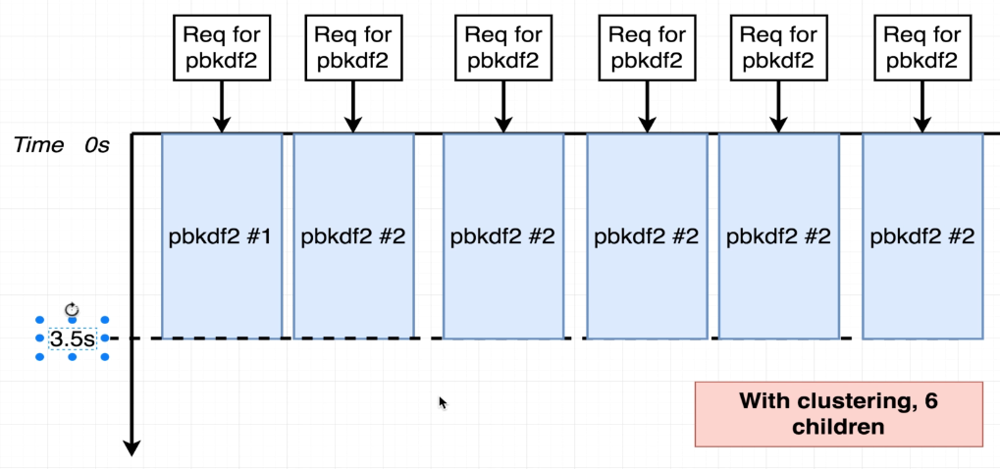
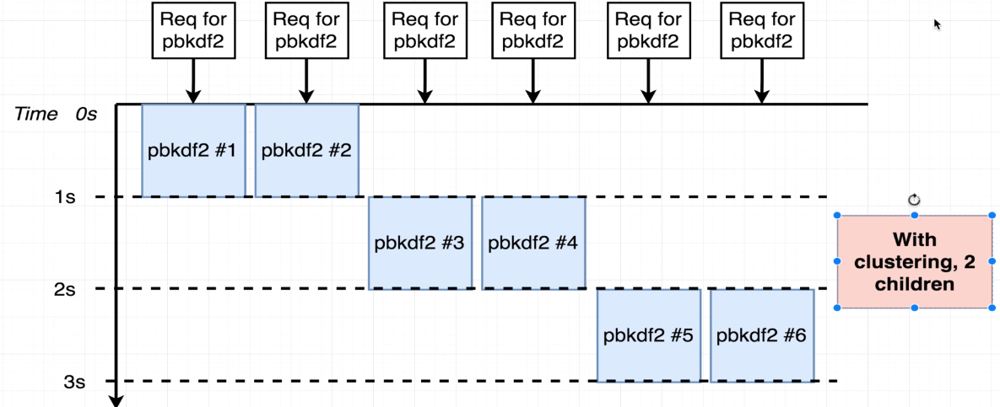

## Problem with Clustering

### Example: Using the `cluster` Module

```javascript
process.env.UV_THREADPOOL_SIZE = 1;

const cluster = require('cluster');
const crypto = require('crypto');
const os = require('os');
const express = require('express');

if (cluster.isMaster) {
    const numCPUs = os.cpus().length;
    console.log(`Master ${process.pid} is running`);

    cluster.fork();

    cluster.on('exit', (worker, code, signal) => {
        console.log(`Worker ${worker.process.pid} died. Spawning a new worker...`);
        cluster.fork();
    });

} else {
    const app = express();
    
    app.get('/delay', (req, res) => {
        crypto.pbkdf2('a', 'b', 100000, 512, 'sha512', () => {
            res.send(`Hi There from Worker ${process.pid} /delay`);
        });
    });

    app.get('/fast', (req, res) => {
        res.send(`Hi There from Worker ${process.pid} (no delay)`);
    });

    app.listen(8000, () => {
        console.log(`Worker ${process.pid} started and listening on port 8000`);
    });
}
```

#### Benchmark Results:

`ab -c 1 -n 1 localhost:8000/delay`

```shell
Document Path:          /
Document Length:        8 bytes

Concurrency Level:      1
Time taken for tests:   1.119 seconds
Complete requests:      1
Failed requests:        0
Total transferred:      206 bytes
HTML transferred:       8 bytes
Requests per second:    0.89 [#/sec] (mean)
Time per request:       1119.189 [ms] (mean)
Time per request:       1119.189 [ms] (mean, across all concurrent requests)
Transfer rate:          0.18 [Kbytes/sec] received
```

`ab -c 2 -n 2 localhost:8000/delay`

```shell
Time per request:       1075.209 [ms] (mean, across all concurrent requests)
Transfer rate:          0.19 [Kbytes/sec] received

Connection Times (ms)
              min  mean[+/-sd] median   max
Connect:        0    0   0.1      0       0
Processing:  1093 1621 747.7   2150    2150
Waiting:     1092 1621 747.8   2150    2150
Total:       1093 1622 747.6   2150    2150

Percentage of the requests served within a certain time (ms)
  50%    2150
  66%    2150
  75%    2150
  80%    2150
  90%    2150
  95%    2150
  98%    2150
  99%    2150
 100%    2150 (longest request)
```

### Visual Representation:


In this image, we can see Node.js first starts processing the first request at 0s to 1s. Then it processes the second request from 1s to 2s. That's why we have a min of 1093ms and a max of 2150ms. This is due to the `crypto.pbkdf2` function, which blocks the event loop. The second request waits for the first request to complete, causing a delay. In this case, we have 1 worker and 1 thread.

---

Next, increase the number of workers:

```javascript
process.env.UV_THREADPOOL_SIZE = 1;

const cluster = require('cluster');
const crypto = require('crypto');
const os = require('os');
const express = require('express');

if (cluster.isMaster) {
    const numCPUs = os.cpus().length;
    console.log(`Master ${process.pid} is running`);

    cluster.fork();
    cluster.fork();

    cluster.on('exit', (worker, code, signal) => {
        console.log(`Worker ${worker.process.pid} died. Spawning a new worker...`);
        cluster.fork();
    });

} else {
    const app = express();
    
    app.get('/delay', (req, res) => {
        crypto.pbkdf2('a', 'b', 100000, 512, 'sha512', () => {
            res.send(`Hi There from Worker ${process.pid} /delay`);
        });
    });

    app.get('/fast', (req, res) => {
        res.send(`Hi There from Worker ${process.pid} (no delay)`);
    });

    app.listen(8000, () => {
        console.log(`Worker ${process.pid} started and listening on port 8000`);
    });
}
```

#### Benchmark Results with 2 Workers:

`ab -c 2 -n 2 localhost:8000/delay`

```shell
Time per request:       585.374 [ms] (mean, across all concurrent requests)
Transfer rate:          0.34 [Kbytes/sec] received

Connection Times (ms)
              min  mean[+/-sd] median   max
Connect:        0    0   0.1      0       0
Processing:  1161 1166   6.9   1170    1170
Waiting:     1159 1164   6.7   1169    1169
Total:       1161 1166   7.0   1171    1171
```


Now we have clustering with 2 children; hence two requests are processed simultaneously. We have a min of 1161ms and a max of 1171ms. Again, the `crypto.pbkdf2` function blocks the event loop, causing the second request to wait. However, with 2 workers, we process both requests concurrently.


```js
process.env.UV_THREADPOOL_SIZE = 1;

const cluster = require('cluster');
const crypto = require('crypto');
const os = require('os');
const express = require('express');

if (cluster.isMaster) {
    // Master process: Fork workers for each available CPU core
    const numCPUs = os.cpus().length;
    console.log(`Master ${process.pid} is running`);

    // Fork a worker process for each CPU core
    cluster.fork();
    cluster.fork();
    cluster.fork();
    cluster.fork();
    cluster.fork();
    cluster.fork();

    // Listen for worker exit and respawn if necessary
    cluster.on('exit', (worker, code, signal) => {
        console.log(`Worker ${worker.process.pid} died. Spawning a new worker...`);
        cluster.fork();
    });

} else {
    // Worker process: Create an Express server with two routes
    const app = express();
    
    // Route with a 5-second delay
    app.get('/delay', (req, res) => {
        crypto.pbkdf2('a', 'b', 100000, 512, 'sha512', () => {
            res.send(`Hi There from Worker ${process.pid} /delay`);
        });
    });

    // Route without any delay
    app.get('/fast', (req, res) => {
        res.send(`Hi There from Worker ${process.pid} (no delay)`);
    });

    // Listen on port 8000
    app.listen(8000, () => {
        console.log(`Worker ${process.pid} started and listening on port 8000`);
    });
}
```

`ab -c 6 -n 6 localhost:8000/delay`
```shell
Time per request:       587.064 [ms] (mean, across all concurrent requests)
Transfer rate:          0.34 [Kbytes/sec] received

Connection Times (ms)
              min  mean[+/-sd] median   max
Connect:        0    1   0.4      1       1
Processing:  3456 3490  26.3   3508    3521
Waiting:     3454 3488  26.2   3505    3519
Total:       3457 3491  26.1   3509    3521

Percentage of the requests served within a certain time (ms)
  50%    3509
  66%    3509
  75%    3510
  80%    3510
  90%    3521
  95%    3521
  98%    3521
  99%    3521
 100%    3521 (longest request)
```


Now we have clustering with 6 children that why six request are processed at the same time. We have min 3457ms and max
3521ms. It's because of the `crypto.pbkdf2` function which is blocking the event loop. Now we increased min time because
we have more children and also more request to process.


```js
process.env.UV_THREADPOOL_SIZE = 1;

const cluster = require('cluster');
const crypto = require('crypto');
const os = require('os');
const express = require('express');

if (cluster.isMaster) {
    // Master process: Fork workers for each available CPU core
    const numCPUs = os.cpus().length;
    console.log(`Master ${process.pid} is running`);

    // Fork a worker process for each CPU core
    cluster.fork();
    cluster.fork();

    // Listen for worker exit and respawn if necessary
    cluster.on('exit', (worker, code, signal) => {
        console.log(`Worker ${worker.process.pid} died. Spawning a new worker...`);
        cluster.fork();
    });

} else {
    // Worker process: Create an Express server with two routes
    const app = express();
    
    // Route with a 5-second delay
    app.get('/delay', (req, res) => {
        crypto.pbkdf2('a', 'b', 100000, 512, 'sha512', () => {
            res.send(`Hi There from Worker ${process.pid} /delay`);
        });
    });

    // Route without any delay
    app.get('/fast', (req, res) => {
        res.send(`Hi There from Worker ${process.pid} (no delay)`);
    });

    // Listen on port 8000
    app.listen(8000, () => {
        console.log(`Worker ${process.pid} started and listening on port 8000`);
    });
}
```
`ab -c 6 -n 6 localhost:8000/delay`
```shell
Time per request:       574.316 [ms] (mean, across all concurrent requests)
Transfer rate:          0.35 [Kbytes/sec] received

Connection Times (ms)
              min  mean[+/-sd] median   max
Connect:        0    0   0.1      0       0
Processing:  1128 2277 1026.2   2256    3445
Waiting:     1126 2276 1026.9   2256    3445
Total:       1128 2277 1026.2   2256    3445

Percentage of the requests served within a certain time (ms)
  50%    2256
  66%    2256
  75%    3432
  80%    3432
  90%    3445
  95%    3445
  98%    3445
  99%    3445
 100%    3445 (longest request)
```


Now making the cluster size equal to the number of cores in the machine. We have min 1128ms and max 3445ms. It's
because we are not giving overload to the machine. So in this case using lesser children we are getting better result.
So creating children greater than physical cores is not always a good idea.