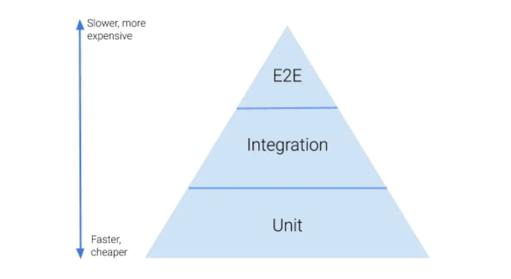

# The Test Pyramid in Node.js

The test pyramid is a metaphor that guides how you should structure your testing efforts. The idea is that you should 
have a large base of unit tests, a smaller layer of integration tests, and an even smaller apex of end-to-end (E2E) 
tests.

[SOURCE](https://medium.com/better-programming/the-test-pyramid-80d77535573)

*   **Unit Tests (Base of the Pyramid):**
    *   **Focus:**  Testing individual units of code (functions, classes, modules) in isolation.  Mocking dependencies is common.
    *   **Goal:**  Fast feedback, pinpoint bugs quickly, ensure code correctness at a granular level.
    *   **Tools:**  Mocha, Jest, Jasmine, Chai, Sinon.js (for mocking).
    *   **Characteristics:**  Fast to run, easy to write, maintainable.
    *   **Example:** Testing a function that calculates a discount amount, verifying it returns the correct value for various inputs.

*   **Integration Tests (Middle Layer):**
    *   **Focus:**  Testing how different parts of your application work together.  This might involve testing the interaction between modules, or between your code and a database.
    *   **Goal:**  Verify that components integrate correctly and that the overall system behaves as expected when the pieces are combined.
    *   **Tools:**  Mocha, Jest, Supertest (for testing HTTP APIs).
    *   **Characteristics:**  Slower than unit tests, more complex to write, provide confidence that the system functions as a whole.
    *   **Example:** Testing an API endpoint that retrieves data from a database, verifying the data is correctly formatted and returned.

*   **End-to-End (E2E) Tests (Apex of the Pyramid):**
    *   **Focus:**  Testing the entire application flow from the user's perspective, simulating real user interactions.  This usually involves testing the front-end and back-end together.
    *   **Goal:**  Ensure the application works correctly from start to finish and that the user experience is as expected.
    *   **Tools:**  Cypress, Playwright, Puppeteer, Selenium.
    *   **Characteristics:**  Slowest to run, most brittle (prone to breaking due to UI changes), provide the highest confidence in application functionality.
    *   **Example:**  Testing the user registration process, verifying the user can sign up, log in, and perform basic actions.

**Why the Pyramid Shape?**

*   **Cost:**  E2E tests are more expensive to write and maintain than unit tests.
*   **Speed:**  Unit tests run much faster than E2E tests.
*   **Isolation:**  Unit tests help you quickly isolate bugs, while E2E tests can be more difficult to debug.

**Important Considerations:**

*   **Don't invert the pyramid:**  Having too many E2E tests and too few unit tests leads to slow, brittle, and expensive testing.
*   **Strive for balance:**  The ideal ratio of test types depends on the complexity of your application.
*   **Test strategically:**  Focus your E2E tests on critical user flows and areas where integration is complex.

